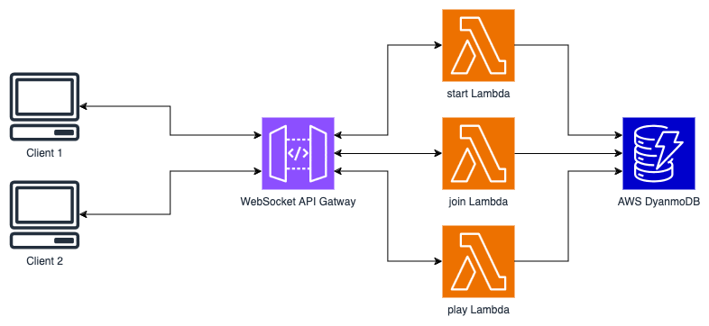
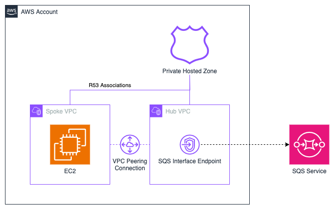
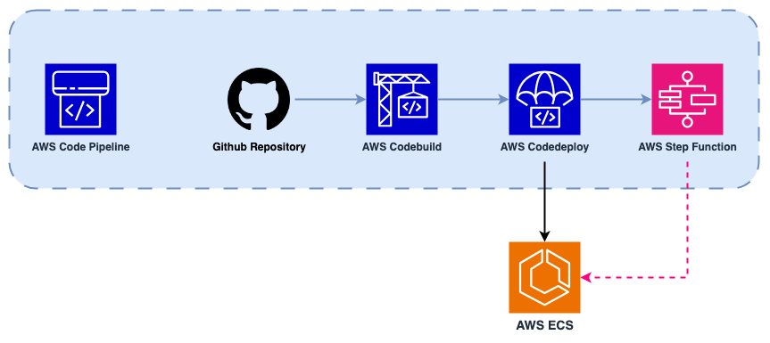
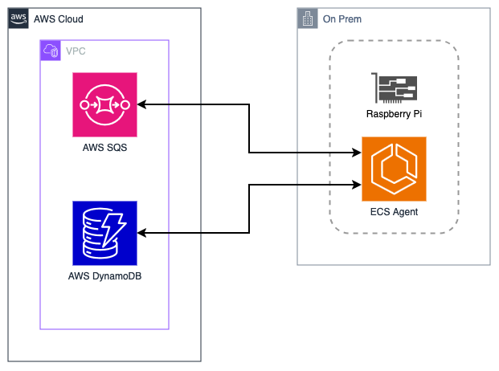
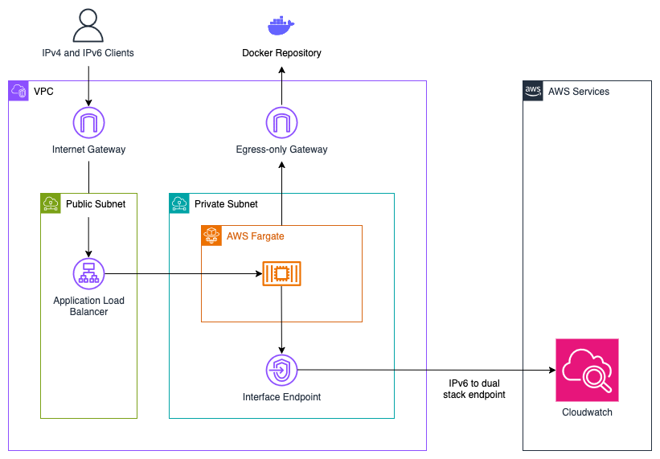
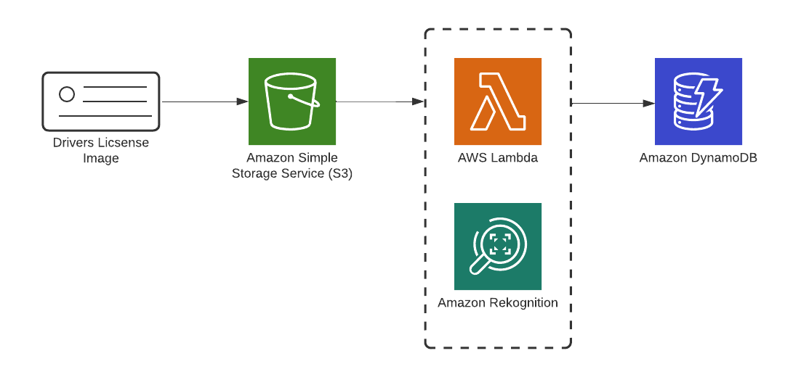
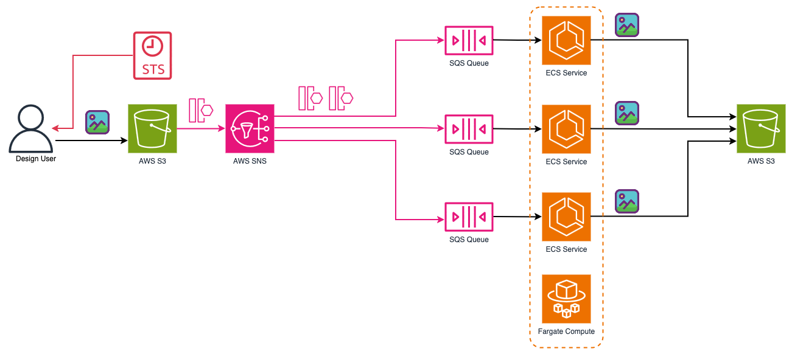
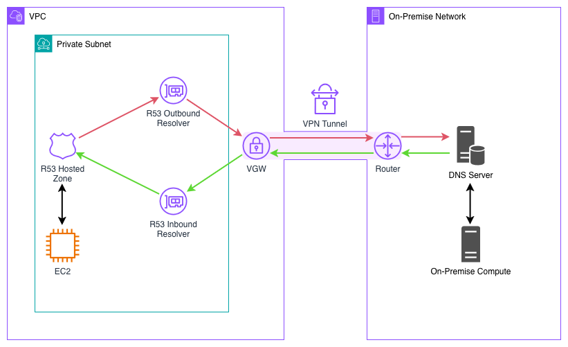

# AWS CDK examples

Examples of small services I've put together using AWS CDK v2 (in typescript) to help learn about the products AWS provides. All diagrams were created using either [Lucid](https://lucid.app) or [drawio](https://www.drawio.com/).

| Example                                         | Description                                                                               | Tags                                                    |
| ----------------------------------------------- | ----------------------------------------------------------------------------------------- | ------------------------------------------------------- |
| [alb-ssl-bridging](./alb-ssl-bridging/)         |              | route 53, fargate, certificate manager, cloudwatch, sns |
| [apigw-to-dynamodb](./apigw-to-dynamodb/)       |           | apigw, dynamodb, lambda, sns                            |
| [apigw-ws](./apigw-ws/)       |           | apigw, dynamodb, lambda                            |
| [central-dns](./central-dns/)       |           | route53, sqs
| [code-deploy](./code-deploy/)       |           | code deploy, code build, code pipeline, lambda                            |
| [cognito-saml-identity-pools](./cognito-saml-identity-pools/)       |           | dynamodb, cognito, fargate                            |
| [dynamo-vpc-gateway-endpoint](./dynamo-vpc-gateway-endpoint/)       |           | dynamodb, cognito, apigw, alb                            |
| [ecs-anywhere](./ecs-anywhere/)       |           | dynamodb, ecs, sqs                            |
| [ecs-full-ipv6](./ecs-full-ipv6/)       |           | ecs, cloudwatch                             |
| [lambda-to-fargate](./lambda-to-fargate/)       |           | apigw, fargate, lambda                                  |
| [rekcognition-text](./rekognition-text/)        |             | s3, lambda, rekognition, dynamodb                       |
| [route53-dnssec-enabled](./route53-dnssec-enabled/)        |             | route53, lambda, kms, api-gateway                       |
| [sqs-sns-fanout](./sqs-sns-fanout/)        |             | sqs, s3, ecs, fargate |
| [step-function-map-io](./step-function-map-io/) |  | stepfunction, s3, lambda, dynamodb                      |
| [vgw-site2site-vpn](./vgw-site2site-vpn/)             |                    | vpc, vgw, vpn                         |
| [vpc-cloudwatch](./vpc-cloudwatch/)             |                    | vpc, cloudwatch, flow logs, ec2                         |
| [waf-cloudfront-ssm](./waf-cloudfront-ssm/)     |        | waf, cloudfront, ssm, vpc, ec2, fargate                 |
