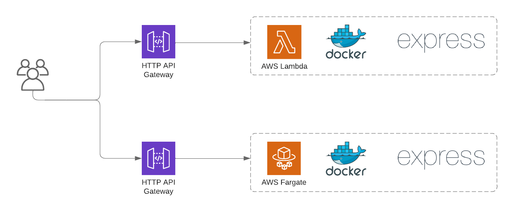

# AWS CDK examples

Examples of small services I've put together to help learn about the products aws provides. All architecture is built use AWS CDK v2 (in typescript). All diagrams were created using [Lucid](https://lucid.app).

| Example                                   | Description                                                                      | Tags                              |
| ----------------------------------------- | -------------------------------------------------------------------------------- | --------------------------------- |
| [apigw-to-dynamodb](./apigw-to-dynamodb/) |               | apigw, dynamodb, lambda, sns      |
| [lambda-to-fargate](./lambda-to-fargate/) |  | apigw, fargate, lambda            |
| [rekcognition-text](./rekognition-text/)  |  | s3, lambda, rekognition, dynamodb |
| [vpc-cloudwatch](./vpc-cloudwatch/)  |  | vpc, cloudwatch, flow logs, ec2 |
| [waf-cloudfront-ssm](./waf-cloudfront-ssm/)  |  | waf, cloudfront, ssm, vpc, ec2, fargate |
