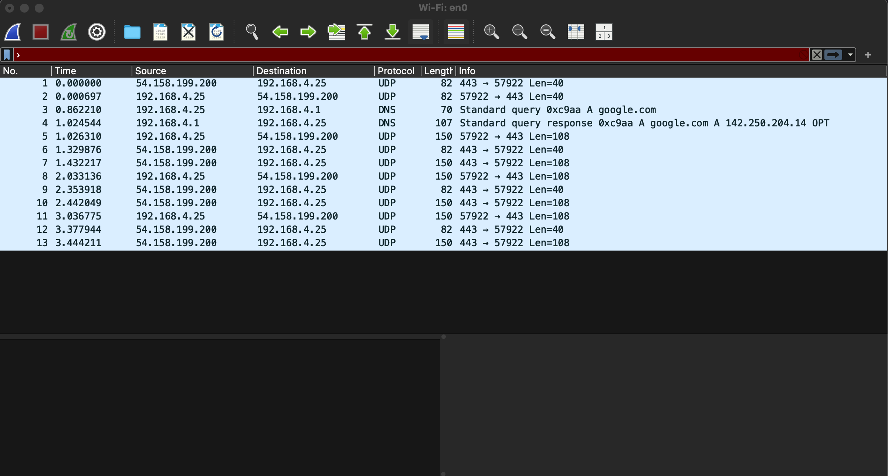

# Advanced Networking Specialty Exercises

While studying for my AWS ANS C01 certification, I stumbled across
[this post](https://dev.to/aws-builders/aws-advanced-networking-specialty-15-hands-on-exercises-for-certification-success-4eh7)
by Arpad Toth which lists a number of practical exercises to help with exam prep.
I've decided to take up the challenge by completing the exercises in CDK.
I've omitted exercises that require multiple accounts or the need to purchase a domain name.

## Exercises 1-4

This is the architecture we will need to implement.


The architecture of exercises 1-4 have been implement in AWS CDK within the stack
named `"Ex1-4Stack"`.

I created two instances from the console and SSHed into then via the Instance
Connect Endpoints created in CDK. We can indeed connect to KMS from VPC B shown
by running the aws kms list-keys command from ec2 instance in VPC B.

```text
[ec2-user@ip-10-0-95-181 ~]$ aws kms list-keys
{
    "Keys": [
        {
            "KeyId": "518efc3e-d0e3-4a62-8356-acefdb91cc7d",
            "KeyArn": "arn:aws:kms:us-east-1:202533509701:key/518efc3e-d0e3-4a62-8356-acefdb91cc7d"
        },
        ...
    ]
}
```

Attempting to call the same command on our ec2 instance from VPC A causes the
command to hang. This is because creates private DNS records to point to ENI/s
created for the interface endpoint. These private DNS records won't automatically
propagate from VPC B to VPC A. This is shown by running the `dig` command on
`kms.us-east-1.amazonaws.com` VPC A and VPB B respectively. Note that the
domain resolves to the public endpoint for VPC A.

```text
[ec2-user@ip-10-0-95-181 ~]$ dig kms.us-east-1.amazonaws.com

; <<>> DiG 9.18.33 <<>> kms.us-east-1.amazonaws.com
;; global options: +cmd
;; Got answer:
;; ->>HEADER<<- opcode: QUERY, status: NOERROR, id: 15307
;; flags: qr rd ra; QUERY: 1, ANSWER: 1, AUTHORITY: 0, ADDITIONAL: 1

;; OPT PSEUDOSECTION:
; EDNS: version: 0, flags:; udp: 4096
;; QUESTION SECTION:
;kms.us-east-1.amazonaws.com.   IN      A

;; ANSWER SECTION:
kms.us-east-1.amazonaws.com. 52 IN      A       67.220.241.181

;; Query time: 0 msec
;; SERVER: 10.0.0.2#53(10.0.0.2) (UDP)
;; WHEN: Fri Feb 28 12:47:00 UTC 2025
;; MSG SIZE  rcvd: 72
```

```text
[ec2-user@ip-10-1-167-200 ~]$ dig kms.us-east-1.amazonaws.com

; <<>> DiG 9.18.33 <<>> kms.us-east-1.amazonaws.com
;; global options: +cmd
;; Got answer:
;; ->>HEADER<<- opcode: QUERY, status: NOERROR, id: 17377
;; flags: qr rd ra; QUERY: 1, ANSWER: 2, AUTHORITY: 0, ADDITIONAL: 1

;; OPT PSEUDOSECTION:
; EDNS: version: 0, flags:; udp: 4096
;; QUESTION SECTION:
;kms.us-east-1.amazonaws.com.   IN      A

;; ANSWER SECTION:
kms.us-east-1.amazonaws.com. 60 IN      A       10.1.58.47
kms.us-east-1.amazonaws.com. 60 IN      A       10.1.139.164

;; Query time: 0 msec
;; SERVER: 10.1.0.2#53(10.1.0.2) (UDP)
;; WHEN: Fri Feb 28 12:46:42 UTC 2025
;; MSG SIZE  rcvd: 88
```

If we attempt to override the endpoint with using the raw
private IPv4 address of the interface endpoint on the instance in VPC A, the
command fails with the following error.

```text
[ec2-user@ip-10-0-95-181 ~]$ aws kms list-keys --endpoint-url https://10.1.58.47

SSL validation failed for https://10.1.58.47/ ("hostname '10.1.58.47' doesn't match either of 'kms.us-east-1.amazonaws.com', 'kms-a.us-east-1.amazonaws.com', 'kms-b.us-east-1.amazonaws.com', 'kms-c.us-east-1.amazonaws.com', 'kms-d.us-east-1.amazonaws.com', 'kms-e.us-east-1.amazonaws.com', 'kms-f.us-east-1.amazonaws.com', 'kms-g.us-east-1.amazonaws.com', '*.kms.us-east-1.vpce.amazonaws.com'",)
```

We could use
[Route 53 Resolver Endpoints](https://docs.aws.amazon.com/Route53/latest/DeveloperGuide/resolver.html)
to get around this issue, meaning yes we could in theory access the interface
endpoint from VPC A (although not demonstrated here).

To answer the question

> VPC A has a CIDR block of 10.0.0.0/16. VPC B's CIDR block is 10.0.0.0/20
> with a secondary CIDR of 10.1.0.0/16. Can we peer VPC A and VPC B?

The AWS VPC peer documentation states

> You cannot create a VPC peering connection between VPCs that have matching or
> overlapping IPv4 or IPv6 CIDR blocks.

To put it simply - no.

## Exercise 8

This is the architecture we will need to implement.


The architecture of exercises 1-4 have been implement in AWS CDK within the
`"Ex8-P1Tgw1Stack"`, `"Ex8-P1Tgw2Stack"` and `"Ex8-P2Stack"` stacks.

The stacks `"Ex8-P1Tgw1Stack"`, `"Ex8-P1Tgw2Stack"` should be deployed first
with `"Ex8-P2Stack"` being deployed after once the transit gateways latter two
stack become available. You will also need to replace peered transit gateway id
filler text in the `"Ex8-P2Stack"` peering connection with the actual id
generated.

Once the `"Ex8-P2Stack"` has deployed, you will need to create static routes in
each of the default transit gateways targeting the peering connections with the
other VPCs CIDR as the routing CIDR. This is an example of what creating the
static route for the `us-east-1` default transit gateway route table might
look like.


Once deployed create instances in the two VPCs created from these stacks in the
console. SSH onto the instance in `us-east-1`, you should be able to ping the
private Ipv4 address of the instance in `us-east-2`.

```text
[ec2-user@ip-10-0-70-63 ~]$ ping 10.1.214.195
PING 10.1.214.195 (10.1.214.195) 56(84) bytes of data.
64 bytes from 10.1.214.195: icmp_seq=1 ttl=124 time=16.6 ms
64 bytes from 10.1.214.195: icmp_seq=2 ttl=124 time=11.8 ms
64 bytes from 10.1.214.195: icmp_seq=3 ttl=124 time=12.0 ms
64 bytes from 10.1.214.195: icmp_seq=4 ttl=124 time=11.3 ms
^C
--- 10.1.214.195 ping statistics ---
4 packets transmitted, 4 received, 0% packet loss, time 3005ms
rtt min/avg/max/mdev = 11.287/12.907/16.599/2.146 ms
```

Creating a view for the network in Network Manager was accomplished by following
the steps from
[this post](https://aws.amazon.com/blogs/networking-and-content-delivery/how-to-use-aws-network-manager-to-visualize-transit-gateways-across-all-accounts-in-the-aws-organization/).


Remember to tear down the created resources by first deleting the ec2 instances
and then running `cdk destroy` on the created stacks.

## Exercise 9

This is the architecture we will need to implement.


The architecture of exercises 1-4 have been implement in AWS CDK within the
`"Ex9Stack"`. Setting up SSL certificates for mutual authentication can be done
by following these steps: <https://docs.aws.amazon.com/vpn/latest/clientvpn-admin/cvpn-getting-started.html>.

Once the stack has been deployed, you can connect to the endpoint using the
AWS provided client, again by following the above instructions. The following
demonstrates that we can ping the instance in our VPC using the VPN.

```text
[home-desktop]$ ping 10.0.43.0
PING 10.0.43.0 (10.0.43.0): 56 data bytes
64 bytes from 10.0.43.0: icmp_seq=0 ttl=254 time=313.077 ms
64 bytes from 10.0.43.0: icmp_seq=1 ttl=254 time=231.098 ms
64 bytes from 10.0.43.0: icmp_seq=2 ttl=254 time=210.756 ms
64 bytes from 10.0.43.0: icmp_seq=3 ttl=254 time=273.390 ms
^C
--- 10.0.43.0 ping statistics ---
4 packets transmitted, 4 packets received, 0.0% packet loss
round-trip min/avg/max/stddev = 210.756/257.080/313.077/39.442 ms
```

We can also `ping google.com` through the VPN. To confirm that the packets are
being sent through the VPN, we can see that the pings are encrypted and sent
over UDP to the VPN endpoint using WireShark (AWS client VPNs use UDP by default
to send encrypted packets).



For reference, this is what pinging `google.com` looks like without a connection
to the VPN.


## Exercise 14

This is the architecture we will need to implement.


The architecture of exercises 1-4 have been implement in AWS CDK within the
`"Ex14Stack"`. Once deployed we create another instance within the public
subnet and ping the other instance provided with the `example.com` domain.

```text
[ec2-user@ip-10-0-249-108 ~]$ nslookup example.com
Server:         10.0.0.2
Address:        10.0.0.2#53

Non-authoritative answer:
Name:   example.com
Address: 10.0.82.95

[ec2-user@ip-10-0-249-108 ~]$ ping !*
ping example.com
PING example.com (10.0.82.95) 56(84) bytes of data.
64 bytes from ip-10-0-82-95.ec2.internal (10.0.82.95): icmp_seq=1 ttl=255 time=5.25 ms
64 bytes from ip-10-0-82-95.ec2.internal (10.0.82.95): icmp_seq=2 ttl=255 time=1.09 ms
64 bytes from ip-10-0-82-95.ec2.internal (10.0.82.95): icmp_seq=3 ttl=255 time=1.70 ms
64 bytes from ip-10-0-82-95.ec2.internal (10.0.82.95): icmp_seq=4 ttl=255 time=1.82 ms
64 bytes from ip-10-0-82-95.ec2.internal (10.0.82.95): icmp_seq=5 ttl=255 time=1.07 ms
^C
--- example.com ping statistics ---
5 packets transmitted, 5 received, 0% packet loss, time 4007ms
rtt min/avg/max/mdev = 1.066/2.184/5.246/1.561 ms
```

## References

* <https://dev.to/aws-builders/aws-advanced-networking-specialty-15-hands-on-exercises-for-certification-success-4eh7>
* <https://docs.aws.amazon.com/whitepapers/latest/building-scalable-secure-multi-vpc-network-infrastructure/transit-gateway.html>
* <https://docs.aws.amazon.com/vpc/latest/privatelink/create-endpoint-service.html>
* <https://docs.aws.amazon.com/vpc/latest/privatelink/privatelink-share-your-services.html>
* <https://docs.aws.amazon.com/vpc/latest/peering/vpc-peering-basics.html#vpc-peering-limitations>
* <https://docs.aws.amazon.com/vpc/latest/tgw/how-transit-gateways-work.html>
* <https://github.com/aws-samples/aws-cdk-transit-gateway-peering/tree/master>
* <https://aws.amazon.com/blogs/networking-and-content-delivery/how-to-use-aws-network-manager-to-visualize-transit-gateways-across-all-accounts-in-the-aws-organization/>
* <https://docs.aws.amazon.com/vpn/latest/clientvpn-admin/cvpn-getting-started.html>
* <https://github.com/aws-samples/aws-cloudwan-workshop-code?tab=readme-ov-file>
