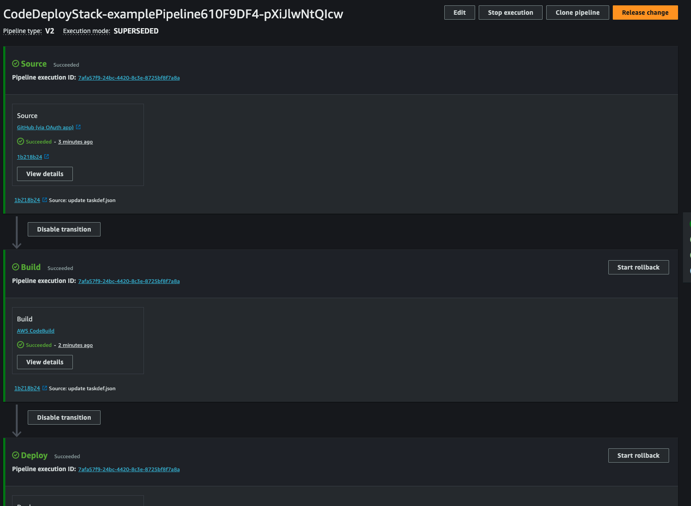

# Build a CI/CD Pipeline Using the AWS Code Suite

AWS offers code pipeline products to enable full CI/CD solutions. This tutorial
will go through the process of creating a standard full CI/CD pipeline using
CodePipeline which builds a Docker image every time a new changed is pushed to a Github repository
and then performs a Blue-Green deployment with the newly build image to an ECS
service.

## Specifying a Pipeline Source

The CodePipeline here will be a code action from a Github action repository.

```typescript
const sourceCodeAction = new codepipeline_actions.GitHubSourceAction({
    actionName: "Source",
    oauthToken: SecretValue.secretsManager("codepipelineExample", {
        jsonField: "githubActionPersonalAccessToken",
    }),
    output: sourceCodeArtifact,
    owner: "<OWNER>",
    repo: "<REPO>",
    branch: "<BRANCH>",
    trigger: codepipeline_actions.GitHubTrigger.WEBHOOK,
});
```

The Codepipeline is divided into stages where information is passed from one
stage to another through the use of 'artifacts'. Artifacts are just references
to objects stored in an S3 bucket used by Codepipeline. Codepipeline stages are
comprised of one or more actions. The above action will provide the next stage
in the pipline for the provided repo and branch. Permissions for AWS to use
GitHub action webhooks are provided through a Github access token stored in
AWS secrets managers, constructed outside of CDK.

## Building the Image with CodeBuild

AWS CodeBuild allows users to build components of their application with AWS
managed compute. Each different build specification is referred as a 'project'
by AWS. Commands for the build specification to execute are provided to
CodeBuild.

```typescript
const exampleProject = new codebuild.PipelineProject(
    this,
    "exampleProject",
    {
    buildSpec: codebuild.BuildSpec.fromObjectToYaml({
        version: 0.2,
        phases: {
        pre_build: {
            commands: [
            "set -euo pipefail",
            "echo Logging in to Amazon ECR",
            "aws --version",
            "aws ecr get-login-password --region ${REGION} | docker login --username AWS --password-stdin ${ACCOUNT}.dkr.ecr.${REGION}.amazonaws.com",
            ],
        },
        build: {
            commands: [
            "echo Build started on `date`",
            "echo Building the Docker image",
            "echo REGION ${REGION}",
            "echo ACCOUNT ${ACCOUNT}",
            "echo REPOSITORY_URI ${REPOSITORY_URI}",
            "COMMIT_HASH=$(echo $CODEBUILD_RESOLVED_SOURCE_VERSION | cut -c 1-7)",
            "IMAGE_TAG=${COMMIT_HASH:=latest}",
            "docker build --platform linux/arm64 --build-arg POSTGRES_HOSTNAME=database.com -t ${REPOSITORY_URI}:latest .",
            "docker tag ${REPOSITORY_URI}:latest ${REPOSITORY_URI}:${IMAGE_TAG}",
            ],
        },
        post_build: {
            commands: [
            "echo Post build started on `date`",
            "echo Pushing the Docker images",
            "docker push ${REPOSITORY_URI}:latest",
            "docker push ${REPOSITORY_URI}:${IMAGE_TAG}",
            "echo Writing image definitions file",
            // A imageDetail.json file is a JSON document that
            // describes your Amazon ECS image URI. This file must be provided
            // for ECS blue/green deployments:
            //  see: https://docs.aws.amazon.com/codepipeline/latest/userguide/file-reference.html#file-reference-ecs-bluegreen
            'printf \'{"ImageURI":"%s"}\' ${REPOSITORY_URI}:${IMAGE_TAG} > imageDetail.json',
            ],
        },
        },
        artifacts: {
            files: ["imageDetail.json", "appspec.yaml", "taskdef.json"],
        },
    }),
    environment: {
        buildImage:
        codebuild.LinuxArmBuildImage.AMAZON_LINUX_2023_STANDARD_3_0,
    },
    environmentVariables: {
        REGION: {
            value: this.region,
            type: codebuild.BuildEnvironmentVariableType.PLAINTEXT,
        },
        ACCOUNT: {
            value: this.account,
            type: codebuild.BuildEnvironmentVariableType.PLAINTEXT,
        },
        REPOSITORY_URI: {
            value: props.appEcrRepository.repositoryUri,
            type: codebuild.BuildEnvironmentVariableType.PLAINTEXT,
        },
    },
    },
);
```

This project simple builds the Docker image using the Dockerfile present in the
repository and uploads it to ECR. Not that files to be passed as artifacts in
this action must be explicitly set in the `artifacts` configuration, in this
case `"imageDetail.json", "appspec.yaml", "taskdef.json"`. We will
talk about the use of these files in the next section. This action construct
required me to explicitly add permission to read/write from the artifact S3
bucket as well as permission to perform action against the ECR repository.

```typescript
/**
 * When you use a cross-account or private registry image, you must use SERVICE_ROLE credentials.
 * https://docs.aws.amazon.com/codebuild/latest/APIReference/API_ProjectEnvironment.html
 */
exampleProject.addToRolePolicy(
    new iam.PolicyStatement({
    effect: iam.Effect.ALLOW,
    resources: ["*"],
    actions: [
        "ecr:BatchCheckLayerAvailability",
        "ecr:CompleteLayerUpload",
        "ecr:GetAuthorizationToken",
        "ecr:InitiateLayerUpload",
        "ecr:PutImage",
        "ecr:UploadLayerPart",
    ],
    }),
);

// Provide the project build access to the artifact bucket
pipelineArtifactBucket.grantPut(exampleProject);
```

## Performing a Deployment with CodeDeploy

Blue-Green deployments are done using CodeDeploy. A 'DeploymentGroup' is used
for the CodeDeploy to configure blue-green target groups as well as the
production and test listeners for the ECS service.

```typescript
this.deploymentGroup = new codedeploy.EcsDeploymentGroup(
    this,
    "app-deployment-group",
    {
    service: appService,
    blueGreenDeploymentConfig: {
        blueTargetGroup: appBlueGreenTargetGroup1,
        greenTargetGroup: appBlueGreenTargetGroup2,
        listener: httpProductionListener,
        testListener: httpTestListener,
    },
    },
);
```

The CodeDeploy action is shown deploy.

```typescript
const deployEcsAction = new codepipeline_actions.CodeDeployEcsDeployAction({
    actionName: "Deploy",
    deploymentGroup: props.deploymentGroup,
    // Note, the default file name is `appspec.yaml` placed in the root of
    // the artifact
    appSpecTemplateInput: buildArtifact,
    // Note, the default file name is `taskdef.json` placed in the root of
    // the artifact
    taskDefinitionTemplateInput: buildArtifact,
    containerImageInputs: [
        {
            input: buildArtifact,
            // Specifies the placeholder value within appspec.yaml file where the
            // image URI should be templated in. The placeholder should also be
            // surrounded by angled brackets within the appspec.yaml file.
            //  see: https://docs.aws.amazon.com/cdk/api/v2/docs/aws-cdk-lib.aws_codepipeline_actions.CodeDeployEcsContainerImageInput.html
            taskDefinitionPlaceholder: "IMAGE1_NAME",
        },
    ],
});
```

The `appspec.yaml` provided through the buildArtifact and specifies what sort
of deployment must be performed. The `taskdef.json` specifies CodeDeploy an ECS
taskdefinition template for the ECS service. The container image sha to use for
the deployment in specified through the `imageDetail.json` file for each input
artifact respectively. In this case the image sha from the `imageDetail.json`
provided by the `buildArtifact` should be templated into the `taskdef.json`
using the tag `"<IMAGE1_NAME>"`.

## Running Step Functions

As a bonus an AWS Stepfunction is run at the end of the pipeline. This
Stepfunction hits a number of endpoints in the deploy service as a smoke test
check that the application is running fine. The CodePipeline action to invoke
the Stepfunction is shown below.

```typescript
const runTestSuiteStateMachineAction =
    new codepipeline_actions.StepFunctionInvokeAction({
    actionName: "runTestSuiteStateMachine",
    stateMachine: props.testRunnerStateMachine,
});
```

The Stepfunction itself in created in the `TestStack`. I'm not going to go into
detail with the Stepfunction, but if you want to learn more see
[my StepFunction CDK example](https://github.com/Michae1CC/aws-cdk-examples/tree/main/step-function-map-io).

## How to Test

First clone the repository

```bash
git clone https://github.com/Michae1CC/aws-cdk-examples
```

and change directory into the `code-deploy` folder.

```bash
cd code-deploy
```

Next create a Github access token with the required permissions from here:
<https://docs.aws.amazon.com/codepipeline/latest/userguide/appendix-github-oauth.html#GitHub-create-personal-token-CLI>.
Create a new AWS Secret named `"githubActionPersonalAccessToken"` containing
this access token. Replace the `"<OWNER>"`, `"<REPO>"` and `"<BRANCH>"`
placeholders with your own values. Then run

```bash
npm install
```

to install the required packages to create our Cloudformation template and then

```bash
cdk bootstrap && cdk deploy AppStack TestStack
```

Note the ECS task role, execution role and family and replace them in the
`taskdef.json`. Next run

```bash
cdk deploy CodeDeployStack
```

Navigate to the CodePipeline project. After a while the pipeline should have
fully executed and your application.



You can try committing and pushing to the application git branch. The pipeline
should run again and deploy the new release without any sort of manual
intervention.

---

### Clean up

First empty all the objects in the artifact bucket, then run

```bash
cdk destroy
```

Optionally delete the AWS Secret contain the Github access token and the token
itself.

## References

* <https://www.youtube.com/watch?v=q8DkatMZvUs>
* <https://www.youtube.com/watch?v=GaWs-LenLYE>
* <https://www.youtube.com/watch?v=YCGb7RP960E&t=1s>
* <https://aws.amazon.com/blogs/devops/integrating-with-github-actions-ci-cd-pipeline-to-deploy-a-web-app-to-amazon-ec2/>
* <https://docs.aws.amazon.com/codepipeline/latest/userguide/tutorials-github-gitclone.html>
* <https://docs.aws.amazon.com/codepipeline/latest/userguide/connections-github.html>
* <https://github.com/beabetterdevv/ci-cd-aws-pipeline-demo>
* <https://github.com/aws-samples/aws-serverless-app-sam-cdk>
* <https://docs.aws.amazon.com/codepipeline/latest/userguide/ecs-cd-pipeline.html>
* <https://docs.aws.amazon.com/codepipeline/latest/userguide/file-reference.html>
* <https://docs.aws.amazon.com/AmazonECS/latest/developerguide/create-blue-green.html>
* <https://docs.aws.amazon.com/codepipeline/latest/userguide/action-reference-ECSbluegreen.html>
* <https://github.com/aws-containers/ecs-workshop-blue-green-deployments>
* <https://docs.aws.amazon.com/codedeploy/latest/userguide/tutorial-ecs-deployment.html>
* <https://docs.aws.amazon.com/codedeploy/latest/userguide/deployment-steps-ecs.html#deployment-process-workflow-ecs>
* <https://aws.plainenglish.io/aws-codepipeline-for-amazon-ecs-part-2-a-blue-green-deployment-type-c162fd73be91>
* <https://docs.aws.amazon.com/AmazonECS/latest/developerguide/create-blue-green.html>
* <https://docs.aws.amazon.com/codepipeline/latest/userguide/tutorials-ecs-ecr-codedeploy.html#tutorials-ecs-ecr-codedeploy-imagerepository>
* <https://docs.aws.amazon.com/cdk/api/v2/docs/aws-cdk-lib.aws_codepipeline_actions.CodeDeployEcsDeployActionProps.html>
* <https://www.jennapederson.com/blog/automate-your-container-deployments-with-ci-cd-and-github-actions/>
