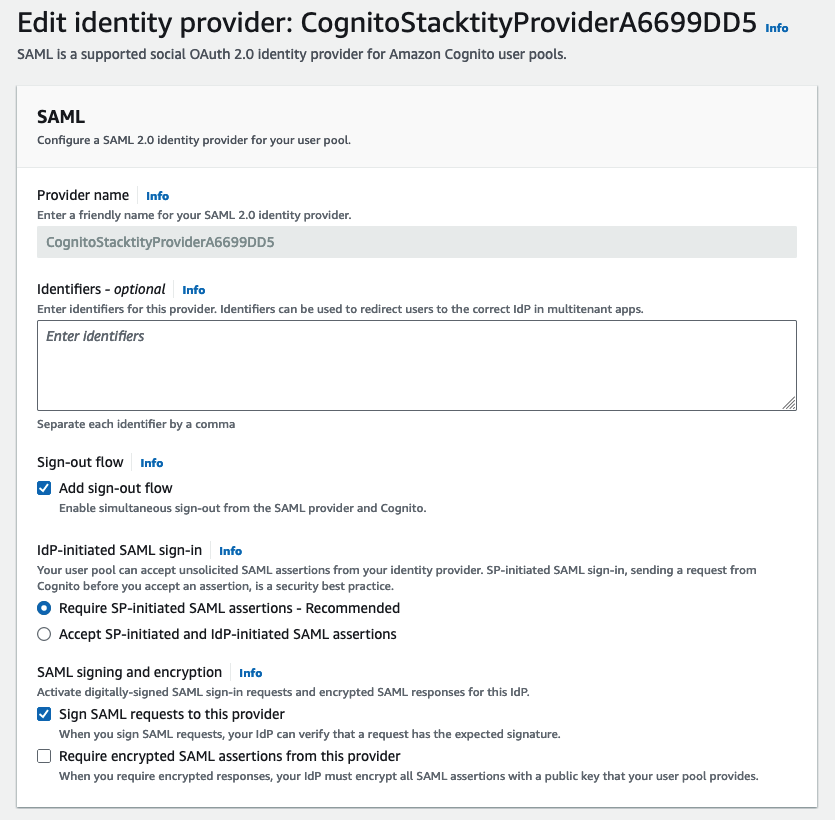
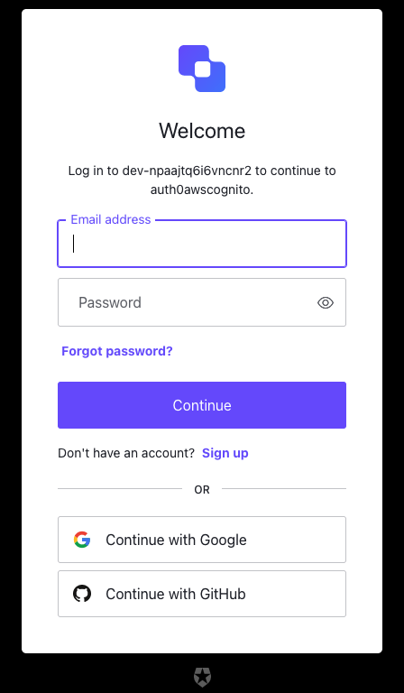
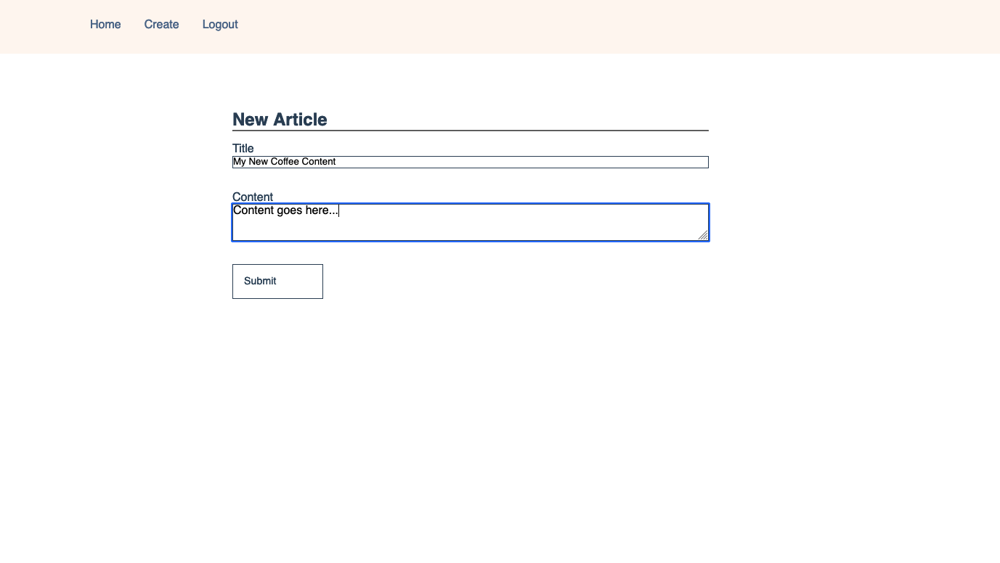
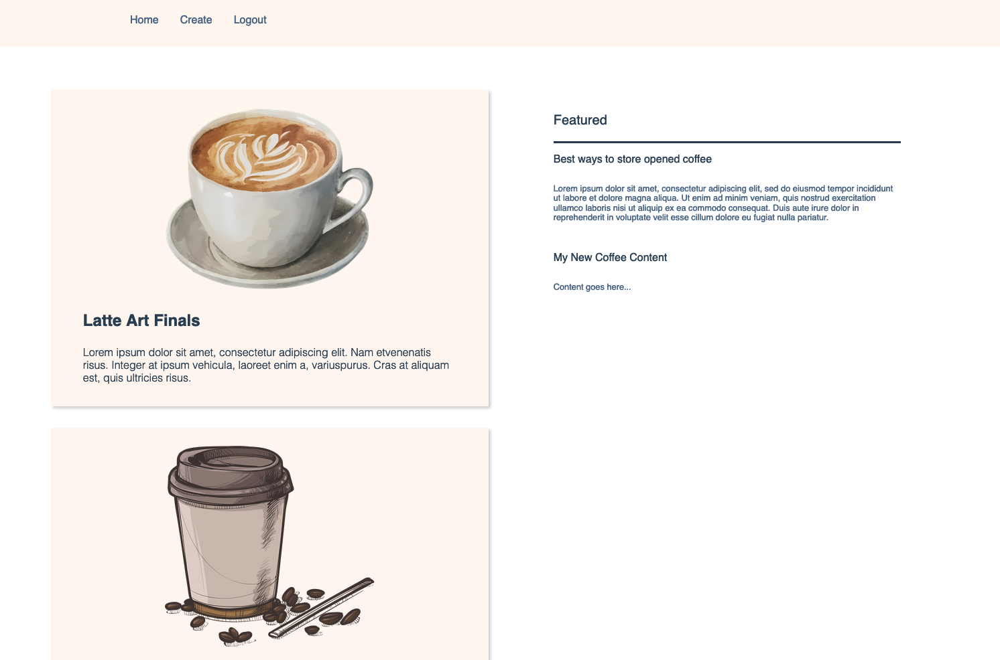

# Cognito User Pools and Identity Pools with SAML IDPs

AWS Cognito provides a mechanism for both user authentication and user
authorization within AWS managed applications. Cognito User Pools handle the
authentication component, allowing one to integrate other Identity Providers
(IDPs) which support SAML or OpenID Connect. Cognito Identity Pool provider
authorization by delegating roles to both authenticated and unauthenticated
users. This tutorial will go over how AWS Cognito can be used to authenticate
user for a simple coffee-blog website where guest users may view
articles and authenticated users may both submit and view articles.

## Global Resources

I'm using the domain `awscdkeg.net` I purchased through Route53 to host the
coffee application as using the hosted zone to create domain certificate.

```typescript
/**
 * Look up the hosted zone created using the registration process
 */
this.hostedZone = route53.HostedZone.fromLookup(
    this,
    "awscdkexamplehostedzone",
    {
    domainName: this.domainName,
    }
);

this.domainCertificate = new acm.Certificate(this, "exampleCertificate", {
    domainName: this.domainName,
    validation: acm.CertificateValidation.fromDns(this.hostedZone),
});
```

A dynamo table will be used to store the submitted articles as items within the
table. Each article will consist of the following information

- A unique UUID identifier
- The email of the user which submitted the article
- The article title
- The article content

Each of these will be kept as string attributes with the table's items. The CDK
used to produce the dynamodb table.

```typescript
this.articleTable = new dynamodb.Table(this, "articleTable", {
    partitionKey: { name: "id", type: dynamodb.AttributeType.STRING },
    billingMode: dynamodb.BillingMode.PAY_PER_REQUEST,
    encryption: dynamodb.TableEncryption.DEFAULT,
    removalPolicy: cdk.RemovalPolicy.DESTROY,
});
```

## Cognito User Pools

User Pools provides an endpoint to authenticate users. From the perspective of
your application, the User Pool is an OIDC IDP which issues identity tokens to
users which successfully authenticate. The way this works is that you can add
third-party IDPs to you User Pools as trusted identity providers. When a user
attempts to authenticate with the User Pool, the User Pool will handle
creating the authentication request to the third party identity provider as
well as the response. The User Pool will then convert the response into an
identity token JSON web token (JWT) as you would in a normal OIDC authentication
transaction. The beauty of this is that even if you add to third-party IDPs
that use different authenticate protocols, the User Pool will 'normalise' the
authentication reponse as a JWT, meaning your application only ever to worry
about needing to consume JWTs from the authentication process.

To start we need to create a User Pool within CDK to act as our OIDC endpoint
for authorising users.

```typescript
this.userPool = new cognito.UserPool(this, "oktaSamlUserPool", {
    userPoolName: "oktaSamlUserPool",
    mfa: cognito.Mfa.OFF,
    selfSignUpEnabled: false,
    removalPolicy: cdk.RemovalPolicy.DESTROY,
});
```

For this tutorial, I'll add a third-party SAML IDP as a way for our User Pool
to authenticate our users. To do this, I've created a free auth0 (owned by okta)
web application and have enabled the SAML addon. We can add this as an identity
provider through the following CDK code:

```typescript
const oktaSamlIdentityProviderMetadata =
    cognito.UserPoolIdentityProviderSamlMetadata.url(
        // Change this our your own metadata URL!
        "https://dev-npaajtq6i6vncnr2.us.auth0.com/samlp/metadata/EjjqseDMDm7vmlxjRO9AeT8YB7xuHI4e"
    );

this.oktaSamlIdentityProvider = new cognito.UserPoolIdentityProviderSaml(
    this,
    "oktaSamlIdentityProvider",
    {
    userPool: this.userPool,
    metadata: oktaSamlIdentityProviderMetadata,
    idpSignout: true,
    attributeMapping: {
            email: cognito.ProviderAttribute.other("email"),
            familyName: cognito.ProviderAttribute.other("family_name"),
            givenName: cognito.ProviderAttribute.other("given_name"),
            nickname: cognito.ProviderAttribute.other("name"),
        },
    }
);

this.userPool.registerIdentityProvider(this.oktaSamlIdentityProvider);
```

Adding the identity provider is required for Cognito to create SAML requests to
our SAML IDP. The attribute mapping will map SAML claims from our SAML IDP to
OIDC attributes.

The following configures a domain for you application to make OIDC requests to,
you can alternative use a domain that you have purchased, otherwise AWS will
otherwise generate one for you. Adding a generated domain is done so with the
following CDK:

```typescript
this.userPool.addDomain("okatSamlUserPoolDomain", {
    cognitoDomain: {
        domainPrefix: this.userPoolDomainPrefix,
    },
});
```

A User Pool client is used to identify and interact with a web or mobile
application. It provides information information on what the application is
permitted to read and modify, which identity providers are permitted to
authenticate users what api calls can be made to authenticate and unauthenticate
and where to redirect users after authentication and unauthentication take
place. The CDK code used to generate our coffee-app client is shown below.
It has permissions to read all our our user's attributes and will use our
SAML IDP to authenticate them.

```typescript
this.oktaSamlClient = this.userPool.addClient("oktaSamlClient", {
    userPoolClientName: "oktaSamlClient",
    generateSecret: true,
    oAuth: {
    callbackUrls: [`https://${props?.domainName}/login`],
    logoutUrls: [`https://${props?.domainName}`],
    flows: {
        // This is not recommended for production settings
        authorizationCodeGrant: false,
        implicitCodeGrant: true,
    },
    // When you authenticate user using the user pool OAuth 2.0
    // authorization server to need to specify the scope of the attributes
    // returned by the server.
    //
    // Here we are allowing all attributes the app client can read.
    scopes: [
            cognito.OAuthScope.OPENID,
            cognito.OAuthScope.EMAIL,
            cognito.OAuthScope.PROFILE,
        ],
    },
    supportedIdentityProviders: [
        cognito.UserPoolClientIdentityProvider.custom(
            this.oktaSamlIdentityProvider.providerName
        ),
    ],
});
```

## Cognito Identity Pools

Identity pools allow us to grant AWS credentials to users on our website.
Different levels can be granted depending on whether the user is authenticated
or not as well as the values returned in the claims. In this example, we will
create an Identity Pool which provides different levels of permissions for
authenticated and unauthenticated users. The CDK code to create our Identity
Pool can be found within the bottom half of our `CognitoStack`

```typescript
this.identityPool = new IdentityPool(this, "oktaSamlIdentityPool", {
    // Allow the identity pool to automatically create the authenticated role
    // and guest role since it's difficult to create the trust policies for
    // these roles by hand. We can simply retrieve the automatically created
    // layer and add our own policies to them.
    identityPoolName: "oktaSamlIdentityPool",
    allowUnauthenticatedIdentities: true,
    authenticationProviders: {
    userPools: [
        new UserPoolAuthenticationProvider({
        userPool: this.userPool,
        userPoolClient: this.oktaSamlClient,
        disableServerSideTokenCheck: false,
        }),
    ],
    },
});
```

This will create the authenticated and unauthenticated user roles with a
pre-created trust policy which only allows Federated Web Identities that have
authenticated through our User Pool client to assume these roles. As mentioned
in the intro, we only want to provide unauthenticated users with
read-only permissions to our article table. To this, we can create a new
IAM policy with read-only permissions to the table and attach and add it to
the pre-created unauthenticated Identity Pool user role.

```typescript
const getCognitoCredentialsStatement = new iam.PolicyStatement({
    effect: iam.Effect.ALLOW,
    resources: ["*"],
    actions: ["cognito-identity:GetCredentialsForIdentity"],
});

const unauthenticatedUserStatement = new iam.PolicyStatement({
    effect: iam.Effect.ALLOW,
    resources: [props.articleTable.tableArn],
    actions: [
    "dynamodb:BatchGetItem",
    "dynamodb:GetItem",
    "dynamodb:Scan",
    "dynamodb:Query",
    ],
});

this.identityPool.unauthenticatedRole.addManagedPolicy(
    new iam.ManagedPolicy(this, "unauthenticatedManagedPolicy", {
    statements: [
        getCognitoCredentialsStatement,
        unauthenticatedUserStatement,
    ],
    })
);
```

We will do something similar with our authenticated user except the role will
also grant put item permission to submit articles.

```typescript
const authenticatedUserStatement = new iam.PolicyStatement({
    effect: iam.Effect.ALLOW,
    resources: [props.articleTable.tableArn],
    actions: [
    "dynamodb:BatchGetItem",
    "dynamodb:BatchWriteItem",
    "dynamodb:PutItem",
    "dynamodb:DeleteItem",
    "dynamodb:GetItem",
    "dynamodb:Scan",
    "dynamodb:Query",
    "dynamodb:UpdateItem",
    ],
});

this.identityPool.authenticatedRole.addManagedPolicy(
    new iam.ManagedPolicy(this, "authenticatedManagedPolicy", {
    statements: [
        getCognitoCredentialsStatement,
        authenticatedUserStatement,
    ],
    })
);
```

Setting up the dynamodb client which uses these credentials to make API calls 
takes place in the client-side `app/app/root.tsx` file.

```typescript
const idTokenString = Cookies.get("idToken");
const logins: Record<string, string> = {};
if (idTokenString) {
    setDecodedJwt(jwtDecode(idTokenString));
    logins[`cognito-idp.${env.REGION}.amazonaws.com/${env.USER_POOL_ID}`] =
    idTokenString;
}
const createDynamoResources = async () => {
    const creds = fromCognitoIdentityPool({
    identityPoolId: env.IDENTITY_POOL_ID,
    clientConfig: { region: env.REGION },
    logins: logins,
    });
    setDynamodbClient(
    new DynamoDBClient({
        region: env.REGION,
        credentials: creds,
    })
    );
};
createDynamoResources();
```

The identity token passed to the application duration when returning from
authentication is stored as a cookie a retrieved here. If the cookie is set,
it is passed in as login information to the `fromCognitionIdentityPool`
which provides credentials for a particular identity pool. If the `logins`
parameter is left as `undefined` then credentials for the unauthenticated user
is provide. On the other hand, the identity token is present then credentials
for the authenticated user role is given.

## How to Test

### Create an IDP

First you will need to create a SAML identity provider. For this example I just
used an auth0 developer account and used that to create an IDP for a web app.

### Setup

First clone this repository

```bash
git clone https://github.com/Michae1CC/aws-cdk-examples
```

and change directory into the `cognito-saml-identity-pools` folder.

```bash
cd cognito-saml-identity-pools
```

Run

```bash
npm install
```

to install the required packages to create our Cloudformation template. Next
bootstrap and deploy your environment.

```bash
cdk bootstrap && cdk deploy
```

Make sure you have docker running during this set. Once deployed, you will need
to make adjustments to your SAML IDP. Ensure that the `aud` attribute in
SAML responses is set to be `urn:amazon:cognito:sp:<USER POOL ID>`. You can find the
User Pool ID from the `USERPOOLID` Cloudformation Output value. You will also
need to follow the steps from [here](https://docs.aws.amazon.com/cognito/latest/developerguide/cognito-user-pools-saml-idp-sign-out.html). This is what my auth0 app json
configuration for the SAML addon ended up looking like:

```json
{
  "audience": "urn:amazon:cognito:sp:<USER POOL ID>",
  "mappings": {
    "user_id": "user_id",
    "email": "email",
    "name": "name",
    "family_name": "family_name"
  },
  "passthroughClaimsWithNoMapping": false,
  "logout": {
    "callback": "https://<USER POOL DOMAIN>.com/saml2/logout",
    "slo_enabled": false
  },
  "signingCert": "<COGNITO SAML IDP SIGNING CERT>",
  "signResponse": true
}
```

Finally, within the AWS console, navigate to your SAML IDP and make sure these
boxes are selected (the Cloudformation Constructs I used to create the User
Pool doesn't currently have the ability to control some of these properties,
if you know an easy fix feel free to PR a solution!).



### Usage

Once deployed we should be able to visit the website of our domain,
in this case `awscdkeg.net`. As a unauthenticated user, your identity pool
will only give you permissions to view articles (stored as dynamodb entries).
You can see these articles in the right colum of the home page


We can login into our coffee, simple click the login button where the SAML
IDP will issue you a challenge to authenticate you. I'm just using a simple
user-name an password challenge to sign into my auth0 app.



The `id_token` provided by your IDP will allow you to assume the
`authenticatedManagedPolicy` that allows us to create items within our dynamodb
table. To create an item, navigatge the `Create` link and fill out the sections
with the article information.



When we hit submit, a request will be made to create a new item with the article
information. We can check that the item was created by going back to the home
adding checking the right column for our new article.



Finally run, the following to destroy the resources from this example

```bash
cdk destroy
```
