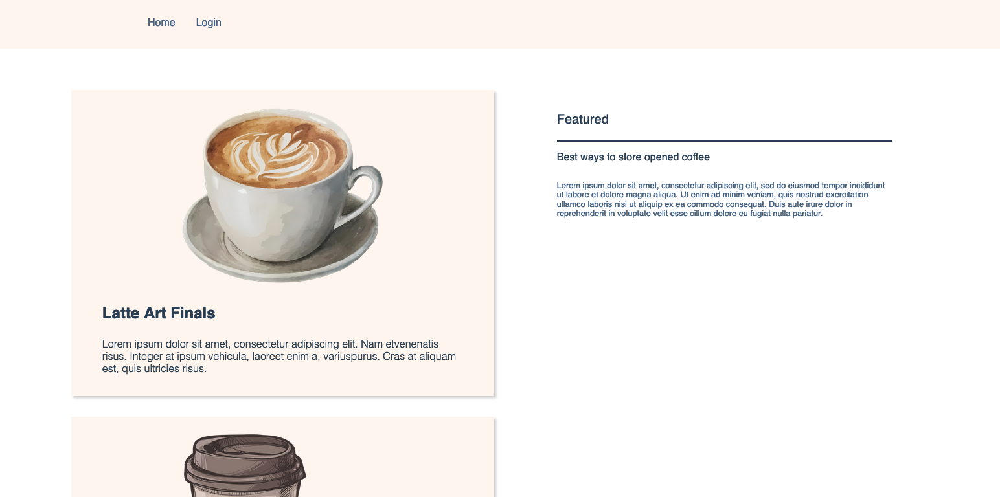

# Welcome to your CDK TypeScript project

This is a blank project for CDK development with TypeScript.

The `cdk.json` file tells the CDK Toolkit how to execute your app.

## Useful commands

* `npm run build`   compile typescript to js
* `npm run watch`   watch for changes and compile
* `npm run test`    perform the jest unit tests
* `npx cdk deploy`  deploy this stack to your default AWS account/region
* `npx cdk diff`    compare deployed stack with current state
* `npx cdk synth`   emits the synthesized CloudFormation template

## How to Test

### Create an IDP

First you will need to create a SAML identity provider. For this example I just
used an auth0 developer account and used that to create an IDP for a web app.

### Setup

First clone this repository

```bash
git clone https://github.com/Michae1CC/aws-cdk-examples
```

and change directory into the `cognito-saml-identity-pools` folder.

```bash
cd cognito-saml-identity-pools
```

Run

```bash
npm install
```

to install the required packages to create our Cloudformation template. Next
bootstrap and deploy your environment.

```bash
cdk bootstrap && cdk deploy
```

Make sure you have docker running during this set. Once deployed, you will need
to make adjustments to your SAML IDP. Ensure that the `aud` attribute in
SAML responses is set to be `urn:amazon:cognito:sp:<USER POOL ID>`. You can find the
User Pool ID from the `USERPOOLID` Cloudformation Output value. You will also
need to follow the steps from [here](https://docs.aws.amazon.com/cognito/latest/developerguide/cognito-user-pools-saml-idp-sign-out.html). This is what my auth0 app json
configuration for the SAML addon ended up looking like:

```json
{
  "audience": "urn:amazon:cognito:sp:<USER POOL ID>",
  "mappings": {
    "user_id": "user_id",
    "email": "email",
    "name": "name",
    "family_name": "family_name"
  },
  "passthroughClaimsWithNoMapping": false,
  "logout": {
    "callback": "https://<USER POOL DOMAIN>.com/saml2/logout",
    "slo_enabled": false
  },
  "signingCert": "<COGNITO SAML IDP SIGNING CERT>",
  "signResponse": true
}
```

Finally, within the AWS console, navigate to your SAML IDP and make sure these
boxes are selected (the Cloudformation Constructs I used to create the User
Pool doesn't currently have the ability to control some of these properties,
if you know an easy fix feel free to PR a solution!).


### Usage

Once deployed we should be able to visit the website of our domain,
in this case `awscdkeg.net`. As a unauthenticated user, your identity pool
will only give you permissions to view articles (stored as dynamodb entries).
You can see these articles in the right colum of the home page



We can login into our coffee, simple click the login button where the SAML
IDP will issue you a challenge to authenticate you. I'm just using a simple
user-name an password challenge to sign into my auth0 app.


The `id_token` provided by your IDP will allow you to assume the
`authenticatedManagedPolicy` that allows us to create items within our dynamodb
table. To create an item, navigatge the `Create` link and fill out the sections
with the article information.


When we hit submit, a request will be made to create a new item with the article
information. We can check that the item was created by going back to the home
adding checking the right column for our new article.


