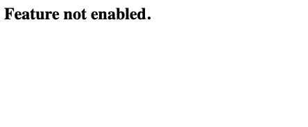

# Dynamo Tables to Control Feature Flags

Dynamodb is a NoSQL key-value pair database. The simplicity and flexibility it
offers makes it good for storing ideal for storing data for deployment
configurations of our applications. This tutorial shows how dynamodb may be
set up provide feature flag information to our running applications.

## Dynamo Gateway Endpoint

The structure of our dynamo items will take the following form

```json
{
    "<FeatureName>": string,
    "<ClientId>#<Stage>": string,
    "Value": boolean
}
```

where `FeatureName` will be the primary key and `<ClientId>#<Stage>` is that
if we know the feature and client id then a query can still be made using the
sort key by checking if the sort key begins with the client id.

Compute within the private subnet will be able to query the table for feature
flags via a Gateway Endpoint. An Gateway Endpoint provides network access to
S3 or Dynamo without the need for a NAT gateway. This works by attaching
new routes to the designated subnet route tables. The CDK used to create the
dynamo table and Gateway Endpoint are shown below.

```typescript
/**
 * A regional mapping from the region name to the aws managed prefix list
 * names and ids for dynamodb. You may need to add an entry if you
 * are deploying to a region that I haven't included. You can find the name key
 * and ID value in the vpc console under the "Managed prefix lists" sub section.
 */
const cfnRegionToManagedPrefixList = new cdk.CfnMapping(
    this,
    "cfnRegionToManagedPrefixList",
    {
    mapping: {
        "us-east-1": {
        prefixListName: "com.amazonaws.us-east-1.dynamodb",
        prefixListId: "pl-02cd2c6b",
        },
        "us-east-2": {
        prefixListName: "com.amazonaws.us-east-2.dynamodb",
        prefixListId: "pl-4ca54025",
        },
        "us-west-1": {
        prefixListName: "com.amazonaws.us-west-1.dynamodb",
        prefixListId: "pl-6ea54007",
        },
        "us-west-2": {
        prefixListName: "com.amazonaws.us-west-2.dynamodb",
        prefixListId: "pl-00a54069",
        },
        "ap-southeast-2": {
        prefixListName: "com.amazonaws.ap-southeast-2.dynamodb",
        prefixListId: "pl-62a5400b",
        },
    },
    }
);

const flagTable = new dynamodb.Table(this, "flagTable", {
    partitionKey: {
    name: "Feature",
    type: dynamodb.AttributeType.STRING,
    },
    sortKey: {
    name: "Target",
    type: dynamodb.AttributeType.STRING,
    },
    billingMode: dynamodb.BillingMode.PAY_PER_REQUEST,
    removalPolicy: cdk.RemovalPolicy.DESTROY,
});

const vpc = new ec2.Vpc(this, "serviceVpc", {
    natGateways: 0,
    maxAzs: 2,
    subnetConfiguration: [
    {
        name: "service",
        cidrMask: 24,
        subnetType: ec2.SubnetType.PRIVATE_WITH_EGRESS,
    },
    ],
});

const dynamoDbEndpoint = vpc.addGatewayEndpoint("dynamoDbEndpoint", {
    service: ec2.GatewayVpcEndpointAwsService.DYNAMODB,
    // All subnets in the VPC
    subnets: undefined,
});

dynamoDbEndpoint.applyRemovalPolicy(cdk.RemovalPolicy.DESTROY);
```

Additionally a policy will need to be configured on the endpoint to specify
exacts what API calls can be made and to what resource.

```typescript
dynamoDbEndpoint.addToPolicy(
    new iam.PolicyStatement({
    principals: [new iam.AnyPrincipal()],
    effect: iam.Effect.ALLOW,
    actions: ["dynamodb:*"],
    resources: [flagTable.tableArn],
    })
);
```

## Service Networking

We won't implement the service exactly in the diagram, instead we will use a
lambda for our compute instead of a auto-scaling group. This is cheaper and
uses the same pattern of querying a dynamo table to influence our software.
The lambda servers a webpage where the text changes from `Feature not enabled.`
to `Hello feature enabled!` when the feature is enabled. The lambda simply makes a
`GetItem` api call to dynamo for the specific client and stage it has been
configured with. AWS CDK provides us
with the `ec2.Peer.prefixList` function to provide with the prefix lists of the
which dynamo gateway endpoints use for various regions. The CDK for the service
lambda and its corresponding security groups are shown below.

```typescript
const lambdaSecurityGroup = new ec2.SecurityGroup(
    this,
    "lambdaSecurityGroup",
    {
    vpc: vpc,
    allowAllOutbound: true,
    }
);

lambdaSecurityGroup.addIngressRule(
    ec2.Peer.prefixList(
    cfnRegionToManagedPrefixList.findInMap(this.region, "prefixListId")
    ),
    ec2.Port.tcp(HTTPS_PORT)
);

const handler = new lambdaJs.NodejsFunction(this, "serviceLambda", {
    memorySize: 256,
    runtime: lambda.Runtime.NODEJS_20_X,
    architecture: lambda.Architecture.X86_64,
    allowPublicSubnet: false,
    vpc: vpc,
    securityGroups: [lambdaSecurityGroup],
    bundling: {
    sourceMap: true,
    },
    environment: {
    FEATURE_FLAG_TABLE_NAME: flagTable.tableName,
    CLIENT_ID: "CLIENT1",
    STAGE: "Prod",
    NODE_OPTIONS: "--enable-source-maps",
    },
    entry: path.join(__dirname, "..", "lambda", "service", "lambda.ts"),
    handler: "handler",
});

handler.addToRolePolicy(
    new iam.PolicyStatement({
    effect: iam.Effect.ALLOW,
    actions: ["dynamodb:*"],
    resources: [flagTable.tableArn],
    })
);
```

Traffic is passed to the lambda using an application load balancer shown below.

```typescript
const applicationLoadBalancer = new elbv2.ApplicationLoadBalancer(
    this,
    "internalApplicationLoadBalancer",
    {
    vpc: vpc,
    // When internetFacing is set to true, denyAllIgwTraffic is set to false
    internetFacing: false,
    ipAddressType: elbv2.IpAddressType.IPV4,
    securityGroup: albSecurityGroup,
    http2Enabled: true,
    }
);

const lambdaListener = applicationLoadBalancer.addListener("httpListener", {
    port: HTTP_PORT,
    // We do not want traffic from any other sources other the ones defined
    // in our security group.
    open: false,
    protocol: elbv2.ApplicationProtocol.HTTP,
});

lambdaListener.addTargets("serviceTarget", {
    targets: [new elbv2_targets.LambdaTarget(handler)],
    healthCheck: {
    enabled: false,
    },
});
```

## API-Gateway

A Http API Gateway is used to tie the service together and gives our users an
endpoint to make calls against the service. Since no public subnets are used,
a private has been configured to route traffic from the `service` path to the
`httpListener`.

```typescript
const httpApiGateway = new apigatewayv2.HttpApi(this, "httpApiGateway", {});

/**
 * Traffic originating from the api-gateway is tunnelled into the vpc
 * via a vpc link. This vpc link is injected into the vpc through an
 * elastic network interface (ENI). Security groups need to be configured
 * on the ENI to communicate with other resources
 * within the vpc. From the perspective of the vpc link's ENI, traffic is
 * routed out to other resources in the vpc. Since security groups are
 * stateful, we only need egress rules for tcp traffic.
 */
const vpcLinkSecurityGroup = new ec2.SecurityGroup(
    this,
    "vpcLinkSecurityGroup",
    {
    vpc: vpc,
    allowAllOutbound: true,
    }
);

vpcLinkSecurityGroup.addIngressRule(
    ec2.Peer.anyIpv4(),
    ec2.Port.icmpPing(),
    "Allow Pings from Ipv4"
);

vpcLinkSecurityGroup.addIngressRule(
    ec2.Peer.anyIpv6(),
    ec2.Port.icmpPing(),
    "Allow Pings from Ipv6"
);

albSecurityGroup.addIngressRule(
    vpcLinkSecurityGroup,
    ec2.Port.tcp(HTTP_PORT),
    "Allows inbound traffic from api gateway vpc link"
);

httpApiGateway.addRoutes({
    path: "/service",
    methods: [apigatewayv2.HttpMethod.GET],
    integration: new apigatewayv2_integrations.HttpAlbIntegration(
    "albIntegration",
    lambdaListener,
    {
        vpcLink: new apigatewayv2.VpcLink(this, "albVpcLink", {
        vpc: vpc,
        securityGroups: [vpcLinkSecurityGroup],
        }),
    }
    ),
});
```

The api gateway also exposes a `flag` endpoint to allow members of the product
team to check and set the values of flags for clients. This works using a lambda
to consume the http request and uses the query parameters provided in the request
to make the appropriate api calls to the dynamo table. Of course, we don't want
any public user to make these requests. Hence a cognito client has been added to ensure
requests made against the `flag` route carry and valid bearer token in their
`Authorization` headers. The cognito client validates the users against a
Okta OIDC provider (acting as our corporate idp).

```typescript
const userPool = new cognito.UserPool(this, "serviceUserPool", {
    userPoolName: "serviceUserPool",
    mfa: cognito.Mfa.OFF,
    selfSignUpEnabled: false,
    removalPolicy: cdk.RemovalPolicy.DESTROY,
});

const oktaOidcProvider = new cognito.UserPoolIdentityProviderOidc(
    this,
    "oktaOidcProvider",
    {
    userPool: userPool,
    clientId: process.env.OKTA_CLIENT_ID!,
    clientSecret: process.env.OKTA_CLIENT_SECRET!,
    issuerUrl: "<YOUR-OIDC-ISSUER-URL>",
    scopes: ["openid"],
    attributeRequestMethod: cognito.OidcAttributeRequestMethod.GET,
    endpoints: {
        authorization: "<YOUR-OIDC-AUTHORIZATION-URL>",
        token: "<YOUR-OIDC-TOKEN-URL>",
        jwksUri: "<YOUR-OIDC-JWKS-URL>",
        userInfo: "<YOUR-OIDC-USER-INFO-URL>",
    },
    }
);

userPool.registerIdentityProvider(oktaOidcProvider);

const userPoolDomain = userPool.addDomain("oktaOidcUserPoolDomain", {
    cognitoDomain: {
    domainPrefix: "oktaoidcuserpooldomain",
    },
});

const oktaOidcClient = userPool.addClient("oktaOidcClient", {
    userPoolClientName: "oktaOidcClient",
    generateSecret: true,
    oAuth: {
    callbackUrls: [`https://jwt.io`],
    flows: {
        authorizationCodeGrant: false,
        implicitCodeGrant: true,
    },
    scopes: [cognito.OAuthScope.OPENID],
    },
    supportedIdentityProviders: [
    cognito.UserPoolClientIdentityProvider.custom(
        oktaOidcProvider.providerName
    ),
    ],
});

const oktaAuthorizer = new apigatewayv2_authorizers.HttpUserPoolAuthorizer(
    "oktaAuthorizer",
    userPool,
    {
    userPoolClients: [oktaOidcClient],
    userPoolRegion: this.region,
    }
);

httpApiGateway.addRoutes({
    integration: new apigatewayv2_integrations.HttpUrlIntegration(
    "token",
    `${userPoolDomain.baseUrl()}/oauth2/authorize?client_id=${
        oktaOidcClient.userPoolClientId
    }&response_type=token&scope=openid&redirect_uri=${encodeURI(
        "https://jwt.io"
    )}`
    ),
    path: "/token",
});

const flagTableHandler = new lambdaJs.NodejsFunction(
    this,
    "flagTableHandler",
    {
    memorySize: 256,
    runtime: lambda.Runtime.NODEJS_20_X,
    architecture: lambda.Architecture.X86_64,
    bundling: {
        sourceMap: true,
    },
    environment: {
        FEATURE_FLAG_TABLE_NAME: flagTable.tableName,
    },
    entry: path.join(__dirname, "..", "lambda", "flag", "lambda.ts"),
    handler: "handler",
    }
);

flagTableHandler.addToRolePolicy(
    new iam.PolicyStatement({
    effect: iam.Effect.ALLOW,
    actions: ["dynamodb:*"],
    resources: [flagTable.tableArn],
    })
);

httpApiGateway.addRoutes({
    integration: new apigatewayv2_integrations.HttpLambdaIntegration(
    "flagTableRoute",
    flagTableHandler
    ),
    path: "/flag",
});
```

## How to Test

### Create an IDP

First you will need to create a OIDC identity provider. For this example I just
used an okta developer account and used that to create an IDP for a web app.
Ensure the OIDC ID an secret are store in the `.env` file and their environment
variable updated in the cdk update if required.

### Setup

First clone this repository

```bash
git clone https://github.com/Michae1CC/aws-cdk-examples
```

and change directory into the `dynamo-vpc-gateway-endpoint` folder.

```bash
cd dynamo-vpc-gateway-endpoint
```

Run

```bash
npm install
```

to install the required packages to create our Cloudformation template. Next
bootstrap and deploy your environment.

```bash
cdk bootstrap && cdk deploy
```

Make sure you have docker running during this set.

### Usage

Once deployed you should be able to immediately be able to access the '/service'
route of the api-gateway, ie. `https://<YOUR-API-GATEWAY-DOMAIN>/service`.



This is because the service code is querying the table and failing to find a
entry for the `HelloFeature` primary key and a sort key of `CLIENT1#Prod`.
Let's try and this entry the feature using the `flag` route! We can try and make a
make of the flag table by running the following command.

```bash
curl -s -X GET https://<YOUR-API-GATEWAY-DOMAIN>/flag
```

although we are met with a `401` return code. This is because api-gateway
is using our cognito user pool expects a bearer token for this. We can get a
bearer from the `/token` route of the api-gateway. Once you authenticate with
your OIDC provider you should be redirected to `jwt.io` with your access token
in the fragment of the return URL. Copy the value of the `access_token` and
set as `TOKEN` within bash, example:

```bash
TOKEN='eyJa...'
```

Let's try running the scan command again, but this time with the bearer token.

```bash
curl -s -X GET --header "Authorization: Bearer $TOKEN" https://<YOUR-API-GATEWAY-DOMAIN>/flag | jq
```

The command should succeed. Now let's add an item to enable the
`HelloFeature` for our service. The command

```bash
curl -s -X GET --header "Authorization: Bearer $TOKEN" 'https://u92zdmzs0e.execute-api.us-east-1.amazonaws.com/flag?feature=HelloFeature&client=CLIENT1&stage=Prod&value=true' | jq
```

should give the output

```json
{
  "Feature": "HelloFeature",
  "Value": true,
  "Target": "CLIENT1#Prod"
}
```

indicating the flag was set successfully. We can also run

```bash
curl -s -X GET --header "Authorization: Bearer $TOKEN" 'https://u92zdmzs0e.execute-api.us-east-1.amazonaws.com/flag?feature=HelloFeature&client=CLIENT1&stage=Prod' | jq
```

to just read the flag of an item for a specific item. Hitting our `\service`
route, we find our `HelloFeature` has now been enabled.


### Teardown

Remember to run

```bash
aws cdk destroy
```

when you no longer need your test environment.


## References

* <https://docs.aws.amazon.com/vpc/latest/privatelink/gateway-endpoints.html>
* <https://docs.aws.amazon.com/vpc/latest/userguide/working-with-aws-managed-prefix-lists.html>
* <https://aws.amazon.com/blogs/compute/understanding-vpc-links-in-amazon-api-gateway-private-integrations/>
* <https://docs.aws.amazon.com/apigateway/latest/developerguide/http-api-develop-integrations-private.html>
* <https://docs.aws.amazon.com/cdk/api/v2/docs/aws-cdk-lib.aws_apigatewayv2_integrations-readme.html#private-integration>
* <https://repost.aws/knowledge-center/api-gateway-application-load-balancers>
* <https://aws.amazon.com/blogs/security/how-to-secure-api-gateway-http-endpoints-with-jwt-authorizer/>
* <https://docs.aws.amazon.com/cdk/api/v2/docs/aws-cdk-lib.Annotations.html>
* <https://sst.dev/examples/how-to-add-github-login-to-your-cognito-user-pool.html>
* <https://docs.aws.amazon.com/lambda/latest/dg/urls-invocation.html>
* <https://docs.aws.amazon.com/cdk/api/v2/docs/aws-cdk-lib.aws_apigatewayv2.HttpIntegration.html>
* <https://blog.ducthinh.net/github-openid-idp-aws-cognito/>
* <https://docs.github.com/en/apps/oauth-apps/building-oauth-apps/authorizing-oauth-apps#2-users-are-redirected-back-to-your-site-by-github>
* <https://developer.okta.com/docs/reference/api/oidc/#well-known-openid-configuration>
