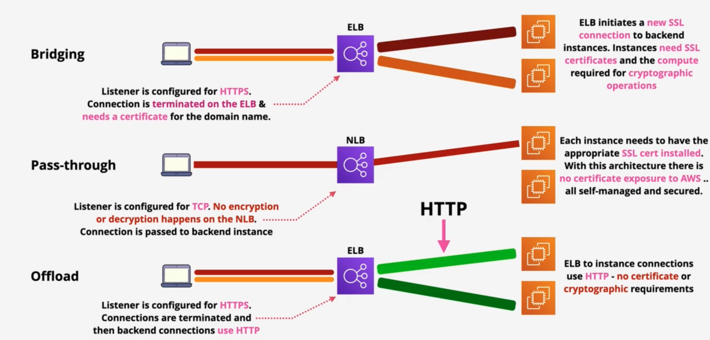

# ALB SSL Bridging

When setting up routing configurations from load balancers to target groups, you
have three options our how HTTPS connections are handled:

* Bridging: Have an ALB decrypt the connect and re-encrypt the traffic when
forwarding it to a target group.
* Pass-through: Have a NLB pass encrypted traffic directly to the target groups.
* Offload: Have an ALB decrypt the connection and have it send un-encrypted
to the target groups.

This slide from Adrian Cantrill's Associate Solutions Architect online course
summaries it nicely:



This tutorial will demonstrate how to set up a simple Fargate Service that
utilizes bridging connections to handle secure traffic. The contents of the Dockerfile
are shown below.

## Website Dockerfile

We will use a nginx Docker Image to generate and server the pages for our
website. No particular reason for using a nginx Docker Image, apart from it
being pretty straight to create and attach a self-signed certificate to our
website.

```Dockerfile
FROM --platform=linux/amd64 nginx:latest

USER root

RUN : \
    && mkdir /etc/nginx/ssl \
    && chmod 700 /etc/nginx/ssl \
    && openssl req -x509 -nodes -days 365 -newkey rsa:2048 -keyout nginx-selfsigned.key -subj /C=AU/ST=/L=/O=/OU=/CN= -out /etc/nginx/ssl/nginx-selfsigned.crt -keyout /etc/nginx/ssl/nginx-selfsigned.key

COPY nginx.conf /etc/nginx/nginx.conf

EXPOSE 443
```

The AWS documentation mentions that if a target group is configured to use HTTPS,
the load balancer will establish a TLS connections with the target group using
certificates installed on the targets. Since these certificates are not checked,
we can used self-signed certificates here. I've generated self-signed certificates
using the `openssl` command and have add them to our nginx configuration. Within
the docker file, we have a `/healthcheck` path that returns empty payload and
status code of 200 (success).

```config
events {
    worker_connections 1024;
}

http {
    server {
        listen 443 ssl;
        server_name localhost;

        ssl_certificate /etc/nginx/ssl/nginx-selfsigned.crt;
        ssl_certificate_key /etc/nginx/ssl/nginx-selfsigned.key;

        location / {
            root /usr/share/nginx/html;
            index index.html;
        }

        location /healthcheck {
            return 200;
        }

        location /healthcheck/ {
            return 200;
        }
    }
}
```

## Routing resources

The following cdk loads in a hosted zone from AWS Route53 hosts the domain used
in this demo. We also create a certificate for the domain here using AWS
certificate Manager which will provide an SSL certificate from a trusted authority
(since a user's browser won't usually trust self-signed certificates).

```typescript
// Create route 53 resources.

/**
 * Look up the hosted zone created using the registration process
 */
const hostedZone = route53.HostedZone.fromLookup(
    this,
    "awscdkexamplehostedzone",
    {
    domainName,
    // Keep the vpc field empty since we would like to keep this as a public
    // hosted zone
    }
);

// Create certificate manager resources

/**
 * This certificate is used for browsers to verify the legitimacy of the
 * domain.
 */
const domainCertificate = new acm.Certificate(this, "exampleCertificate", {
    domainName: domainName,
    validation: acm.CertificateValidation.fromDns(hostedZone),
});
```

## Health Check Resources

We will create a few resources that will detect if the service endpoint is
no longer responding and has fallen in a bad state (no longer returning `2xx`
or `3xx` status codes). To start we can create a health check in route53 that
will periodically hit our domain using `HTTPS`.

```typescript
/**
 * Create a route53 health check that will make requests to the /healthcheck
 * path of our service.
 */
const healthCheck = new route53.CfnHealthCheck(this, "serviceHealthCheck", {
    healthCheckConfig: {
    type: "HTTPS",
    requestInterval: cdk.Duration.seconds(10).toSeconds(),
    failureThreshold: 2,
    fullyQualifiedDomainName: domainName,
    port: HTTPS_PORT,
    resourcePath: "/healthcheck",
    },
});
```

This will generate a metric within the `HealthCheckStatus` metrics which we can
refer to in cdk.

```typescript
/**
 * Create a metric that monitors the number of successful/failed checks
 */
const healthCheckMetric = new cloudwatch.Metric({
    namespace: "AWS/Route53",
    metricName: "HealthCheckStatus",
    dimensionsMap: {
    HealthCheckId: healthCheck.attrHealthCheckId,
    },
    statistic: cloudwatch.Stats.MINIMUM,
    period: cdk.Duration.seconds(30),
});
```

We can add an alarm to this metric which activates when pings fail too often
within a certain period of time.

```typescript
/**
 * Create an alarm when the healthCheck fails too often for too long.
 */
const healthCheckAlarm = healthCheckMetric.createAlarm(
    this,
    "route53Alarm",
    {
    actionsEnabled: true,
    comparisonOperator: cloudwatch.ComparisonOperator.LESS_THAN_THRESHOLD,
    threshold: 1,
    evaluationPeriods: 2,
    alarmDescription: "Route53 bad status",
    }
);
```

In response to an alarm, we can send a notification to a on-call SNS topic.

```typescript
/**
 * Kms Key for Sns topic
 */
const kmsKey = new kms.Key(this, "SnsKmsKey", {
    description: "KMS key used for SNS",
    enableKeyRotation: true,
    enabled: true,
    removalPolicy: cdk.RemovalPolicy.DESTROY,
});

/**
 * Create an sns topic to alert engineers of a failed health check
 */
const snsTopic = new sns.Topic(this, "SnsTopic", {
    masterKey: kmsKey,
});

// Check that an email has been provided in our SNS topic, otherwise fail
// the build
if (process.env.SNS_EMAIL === undefined) {
    throw new Error("No SNS email provided");
}

snsTopic.addSubscription(
    new sns_subscriptions.EmailSubscription(process.env.SNS_EMAIL)
);

/**
 * Send a message to the SNS topic when our health check goes into alarm.
 */
healthCheckAlarm.addAlarmAction(new cloudwatch_actions.SnsAction(snsTopic));
```

We will also make our Fargate service roll back to an earlier deployment, which
we will see later.

## Network resources

The VPC used here creates a public and private subnet. The public one will hold
an ALB that is publicly facing. The ALB will allow any incoming HTTP or HTTPS
connection. The private subnet will contain our Fargate service that will listen
for incoming connections forwarded by the ALB. NAT Gateways are present in the
private subnets so that fargate can discover and pull images from ECR.

```typescript
/**
 * Create a VPC that occupies two AZs and has both a public and private
 * subnet. The NAT GWs are using for fargate instances within the private
 * subnet to discover/pull from ECR.
 */
const vpc = new ec2.Vpc(this, "serviceVpc", {
    natGateways: 2,
    maxAzs: 2,
    subnetConfiguration: [
    {
        name: "public-subnet",
        subnetType: ec2.SubnetType.PUBLIC,
        cidrMask: 24,
    },
    {
        name: "private-subnet",
        subnetType: ec2.SubnetType.PRIVATE_WITH_EGRESS,
        cidrMask: 24,
    },
    ],
});
```

## Service Resources

The service is basically comprised of the ALB and Fargate Service construct.
The Fargate service is configured to run the Docker image shown above. It is
not provided a public IP since traffic coming into the service should be
redirected from the ALB. If our health check alarm is in alarm, we want to
roll back the deployment to the previous image.

```typescript
const fargateService = new ecs.FargateService(this, "fargateService", {
    cluster,
    taskDefinition,
    deploymentAlarms: {
    alarmNames: [healthCheckAlarm.alarmName],
    behavior: ecs.AlarmBehavior.ROLLBACK_ON_ALARM,
    },
    vpcSubnets: {
    subnetType: ec2.SubnetType.PRIVATE_WITH_EGRESS,
    },
    assignPublicIp: false,
    securityGroups: [fargateSecurityGroup],
    desiredCount: 1,
    minHealthyPercent: 0,
    maxHealthyPercent: 100,
});
```

The load balancer on the other hand will be public facing and is given IPv4 
addressing.

```typescript
const loadBalancer = new elbv2.ApplicationLoadBalancer(this, "serviceAlb", {
    vpc: vpc,
    internetFacing: true,
    ipAddressType: elbv2.IpAddressType.IPV4,
    securityGroup: albSecurityGroup,
    http2Enabled: true,
});
```

An A-record is created in our hosted zone that maps the Ipv4 address the AWS
gives this ALB to our domain

```typescript
/**
 * Create an A record associating our load balancer's IP address to
 * the domain name create using route53
 */
new route53.ARecord(this, "albARecord", {
    zone: hostedZone,
    recordName: domainName,
    target: route53.RecordTarget.fromAlias(
    new route53_targets.LoadBalancerTarget(loadBalancer)
    ),
});
```

This rest of this is just setting up listeners and target groups to forward
traffic to our Fargate Service from ALB. What is important is that the target
group is configured to use HTTPS. This indicates to the ALB that TLS connections
are to be when directing traffic to this target group.

```typescript
const targetGroup = new elbv2.ApplicationTargetGroup(this, "targetGroup", {
    vpc: vpc,
    // Specifying a protocol and port of HTTPS_PORT and HTTPS (respectively)
    // will cause our ALB to communicate to our target group using HTTPS
    protocol: elbv2.ApplicationProtocol.HTTPS,
    port: HTTPS_PORT,
    healthCheck: {
    protocol: elbv2.Protocol.HTTPS,
    path: "/healthcheck",
    },
});
```

## References

* <https://learn.cantrill.io/courses/1820301/lectures/41301447>
* <https://learn.cantrill.io/courses/2022818/lectures/45660745>
* <https://docs.aws.amazon.com/elasticloadbalancing/latest/application/load-balancer-target-groups.html#target-group-routing-configuration>
* <https://docs.aws.amazon.com/elasticloadbalancing/latest/application/load-balancer-update-security-groups.html>
* <https://docs.aws.amazon.com/AmazonECS/latest/APIReference/API_PortMapping.html>
* <https://www.cloudflare.com/learning/dns/glossary/dns-zone/>
* <https://aws.amazon.com/route53/faqs/>
* <https://medium.com/@miladev95/nginx-with-self-signed-certificate-on-docker-a514bb1a4061>
* <https://github.com/aws-samples/serverless-patterns/tree/main/route53-alb-fargate-cdk-dotnet>
* <https://docs.aws.amazon.com/AmazonECS/latest/bestpracticesguide/networking-networkmode-awsvpc.html>
* <https://nedvedyang.medium.com/create-a-cloudformation-template-for-route53-health-check-cloudwatch-alarms-and-sns-49f70d3b3f92>
