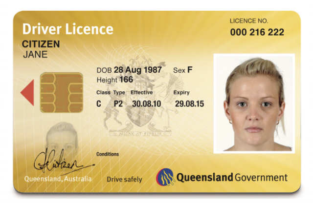
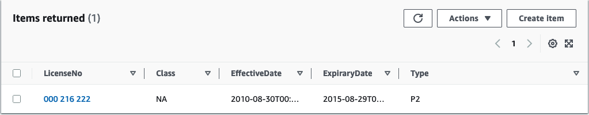

# Rekognition Text Extraction

This example was inspired by the sign up process of Uber CarShare, where
users are required to provide a photo of there license to extract user
details and ultimately identify them. We can use AWS Rekognition to
automate feature extraction from drivers license. At a high level, this
services will store license images in an S3 bucket. Whenever a new image
in uploaded to our bucket, we will trigger a lambda function that will build
a Rekognition client and perform image analysis and text extract from the
newly uploaded image. We can then send the extracted text to dynamodb for
later use.

## Data Storage

The stack itself is fairly simple, at the top of our cdk, we defined our bucket to upload images to as well as the dynamodb to store extracted text

```typescript
// S3 core
const bucket = new Bucket(this, "LICENSE_IMAGES");

// DynamoDB Table
const table = new Table(this, "LICENSE_RECORDS", {
  partitionKey: { name: "LicenseNo", type: AttributeType.STRING },
  billingMode: BillingMode.PAY_PER_REQUEST,
  removalPolicy: RemovalPolicy.DESTROY,
});
```

The only thing interesting going one here is that we have defined a key within the dynamodb to uniquely identify the drivers license, in this case we are using the license number.

## Lambda

Of course, we will need to define a lambda function to process our images.

```typescript
// lambda
const lambda = new Function(this, "LICENSE_FUNCTION", {
  runtime: Runtime.PYTHON_3_9,
  code: Code.fromAsset(path.join(__dirname, "..", "src", "image_lambda")),
  handler: "lambda.handler",
  initialPolicy: initialPolicy,
  environment: {
    DYNAMODB_TABLE: table.tableName,
  },
});

...

// Add an S3 event to the lambda
lambda.addEventSource(
  new cdk.aws_lambda_event_sources.S3EventSource(bucket, {
    events: [EventType.OBJECT_CREATED],
  })
);
```

Passing the dynamodb table name as an `environment` is needed so that we have some way to access the table within our lambda function. The event source is used to trigger our lambda every time a new image is uploaded to the aforementioned S3 bucket. I've intentionally left out an explanation for the `initialPolicy` field, but we will circle back to that soon!

## IAM

Before, we deploy this stack, we need to make sure a function has nesseccary permissions to access other components of our services. To start, our lambda will require read access to our S3 bucket to access uploaded license images as well as write permissions to the dynamodb to add entries of the extracted text.

```typescript
// Grant our lambda read permissions for s3 and
// write permissions for dynamo
bucket.grantRead(lambda);
table.grantWriteData(lambda);
```

The lambda function also needs explicit access to invoke certain methods from our Rekognition client. For this service, I'd like the lambda function above to have access to Rekognition's detect text and detect labels features. These policies are formulated as shown below.

```typescript
// Policies to attach to our lambda
const initialPolicy: Array<PolicyStatement> = [
  new PolicyStatement({
    effect: Effect.ALLOW,
    actions: ["rekognition:DetectText"],
    resources: ["*"],
  }),
  new PolicyStatement({
    effect: Effect.ALLOW,
    actions: ["rekognition:DetectLabels"],
    resources: ["*"],
  }),
];
```

## Lambda Code

Here's the handler that used every time our lambda function is invoked

```python
def handler(event, context):
    logger: logging.Logger = logging.getLogger(__name__)
    logger.setLevel(logging.INFO)
    logger.info("request: " + json.dumps(event))

    if not TABLE_NAME:
        message = "Could not find table name from environemnt."
        logger.error(message)
        return {"statusCode": 500, "body": message}

    try:
        for record in event["Records"]:
            # Get the S3 bucket object info
            bucket_name = record["s3"]["bucket"]["name"]
            key = record["s3"]["object"]["key"]
            image_id = {
                "S3Object": {
                    "Bucket": bucket_name,
                    "Name": key,
                }
            }

            label_response: dict = rekognition_client.detect_labels(Image=image_id)
            logger.info(json.dumps(label_response))

            # Skip the image if it is not a license
            if not is_license(label_response):
                logger.info(f"Image {key} was not deemed to be a drivers license.")
                continue

            text_response: dict = rekognition_client.detect_text(Image=image_id)
            logger.info("text response" + json.dumps(text_response))
            detections: list[dict] = text_response["TextDetections"]

            # Construct a list of all the detected labels
            labels: list[str] = [label["DetectedText"] for label in detections]
            effective_date, expirary_date = get_effective_expiry(labels)
            dynamodb_client.put_item(
                TableName=TABLE_NAME,
                Item={
                    "LicenseNo": {"S": get_license_no(labels)},
                    "EffectiveDate": {"S": effective_date},
                    "ExpiraryDate": {"S": expirary_date},
                    "Class": {"S": get_license_class(labels)},
                    "Type": {"S": get_license_type(labels)},
                },
            )
    except ClientError as e:
        logger.error(e)
        return {"statusCode": 500, "body": str(e)}

```

First we create a reference to our image in S3 using the `image_id` variable. We then use Rekognition's label feature to provide a list of categories that it thinks this image belongs to. We use this feature here to determine if the image if provided with a "Drivers License" label and to skip processing this image if it lacks this label. Next Rekognition's text feature is used to extract parts of the text from the license. Helper methods are used to filter through all the text fields to populate the new dynamodb entry.

## How To Test

First clone this repository

```bash
git clone https://github.com/Michae1CC/aws-cdk-examples
```

and change directory into the apigw-to-dynamodb folder.

```bash
cd apigw-to-dynamodb
```

Run

```bash
npm install
```

to install the required packages to create Cloudformation template and then

```bash
cdk deploy
```

to deploy these resources to the cloud. You should hopefully see the following outputs after deployment

```
Outputs:
RekognitionTextStack.LambdaName = <lambda-name>
RekognitionTextStack.S3BucketName = <bucket-name>
RekognitionTextStack.TableName = <table-name>
Stack ARN:
arn:aws:cloudformation:us-east-1:221318883170:stack/RekognitionTextStack/4340bd80-e7d5-11ed-9242-12e66b7f04bb
```

To test out our service we can upload the following sample Queensland drivers license found under the `img` folder to our S3 bucket.



We can upload the image using the following [aws cli](https://aws.amazon.com/cli/) command.

```bash
aws s3 cp ./img/example_license.png s3://<bucket-name>
```

Within your aws console, you can navigate to `Lambda > <lambda-name> > Monitor > Logs > Recent invocations` to confirm your lambda function wass triggered. You should also see the following entry within the newly created dynamodb.



# References

- https://serverlessland.com/patterns/s3-lambda-transcribe-cdk
- https://github.com/dan-mba/aws-cdk-rekognition
- https://docs.aws.amazon.com/rekognition/latest/dg/text-detecting-text-procedure.html
- https://github.com/aws-samples/aws-cdk-examples/tree/master/python/image-content-search
