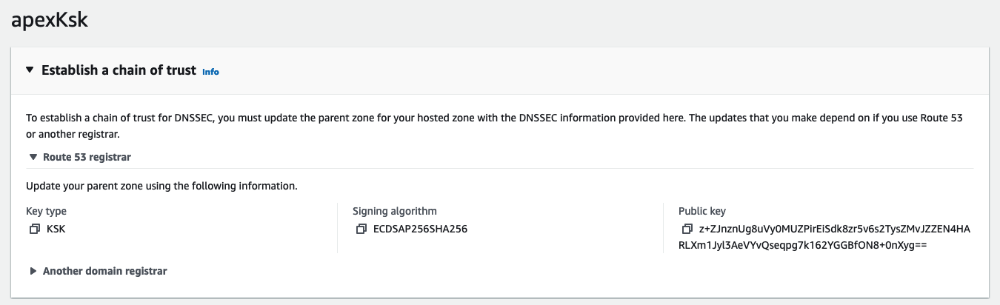
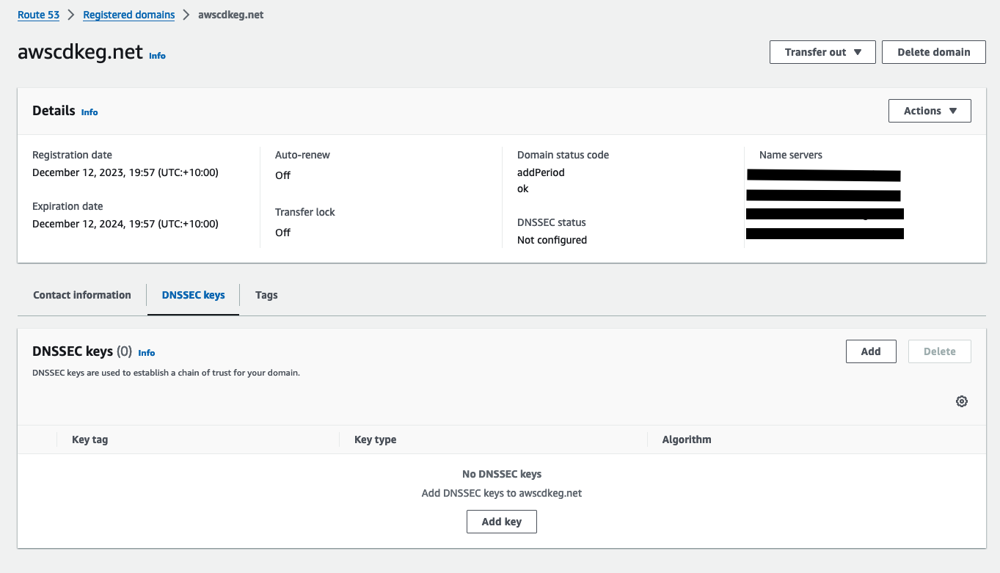
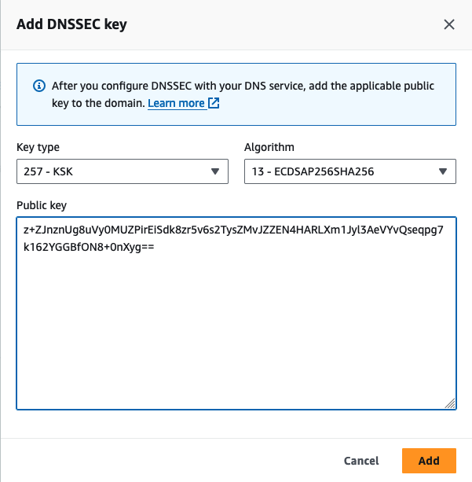
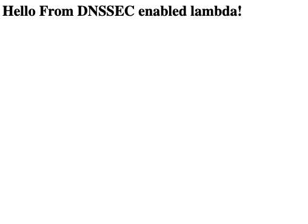
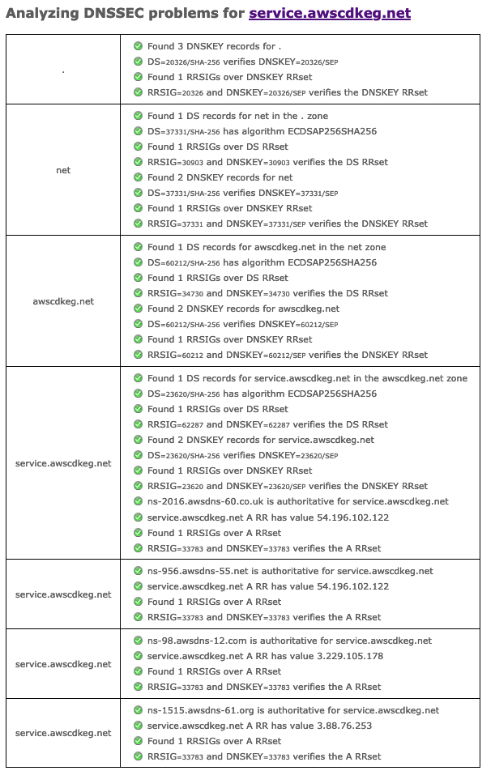
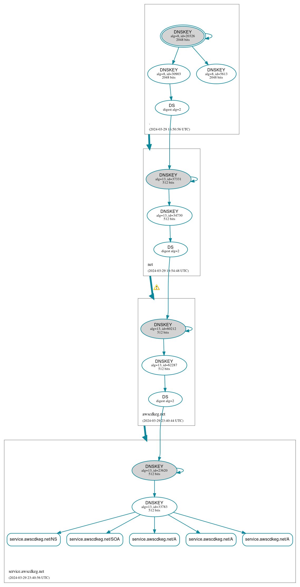

# Enabling DNSSEC in Route53 using Cfn Custom Resources

DNSSEC is a security feature of DNS which allows owners of DNS zones to
sign records thwarting attacks such as DNS cache poisoning and DNS spoofing.
AWS Route53 allows owners of hosted zones to enable DNSSEC. This can be a little
tricky to do with teams that are managing infrastructure with code since
enabling DNSSEC involves liaising with with top level domains that are outside
the control of AWS. This tutorial outlines a method that keeps as much of the
DNSSEC setup within CDK.

## Creating the Apex Domain and Service Sub-Domain

The following cdk loads in a hosted zone from AWS Route53 hosts the domain used
in this demo. This domain was registered manually through the Route53 console
and is imported into cdk using the `route53.HostedZone.fromLookup` method.

```typescript
this.apexHostedZone = route53.HostedZone.fromLookup(
    this,
    "apexHostedZone",
    {
        domainName: this.domainName,
    }
);
```

We can create a new hosted zone for the service sub-domain easily enough.

```typescript
this.serviceHostedZone = new route53.HostedZone(this, "serviceHostedZone", {
    zoneName: this.subDomainName,
});
```

However we will need new NS DNS records in our apex domain to point to our
sub-domain so that sub-domain specific DNS queries are delegated to the
appropriate servers.

```typescript
new route53.NsRecord(this, "serviceNsRecord", {
    zone: this.apexHostedZone,
    recordName: this.subDomainName,
    values: this.serviceHostedZone.hostedZoneNameServers!,
    ttl: cdk.Duration.minutes(5),
});
```

I've pre-emptively lowered each of the zone's maximum to 5mins as a recommendation
from the AWS documentation: <https://docs.aws.amazon.com/Route53/latest/DeveloperGuide/dns-configuring-dnssec-enable-signing.html>.
The idea is to reduce the wait time between enabling signing and and inserting
DS records into the parent zones. It also means you can act more swiftly in the
event of a rollback. The end goal will be to have DNSSEC enabled for both our
apex and service sub-domain.

## Creating Key Signing Keys

We can use asymmetric AWS KMS to use as Key Signing Keys (KSKs) within our DNSSEC setup.
To read more on KSKs (what they are and their importance in DNSSEC) I'd recommend
reading through this cloudflare article: <https://www.cloudflare.com/dns/dnssec/how-dnssec-works/>.
From the AWS docs, the KSKs must be an asymmetric key with an `ECC_NIST_P256` key spec.

```typescript
const apexKmsKey = new kms.Key(this, "apexKmsKey", {
    enableKeyRotation: false,
    keySpec: kms.KeySpec.ECC_NIST_P256,
    keyUsage: kms.KeyUsage.SIGN_VERIFY,
    removalPolicy: cdk.RemovalPolicy.DESTROY,
});
```

The `dnssec-route53.amazonaws.com` principal will require a number of different
permissions to our KSKs (created through KMS) to sign new records entered into
hosted zones. These permissions can be attached through the KMS key's resource policy.

```typescript
// Add to the resources policy of the KMS key to allow AWS route53 to use the customer managed
// keys, see: https://docs.aws.amazon.com/Route53/latest/DeveloperGuide/access-control-managing-permissions.html#KMS-key-policy-for-DNSSEC
apexKmsKey.addToResourcePolicy(
    new iam.PolicyStatement({
    sid: "Allow Route 53 DNSSEC Service for apex domain KSK",
    effect: iam.Effect.ALLOW,
    principals: [new iam.ServicePrincipal("dnssec-route53.amazonaws.com")],
    actions: ["kms:DescribeKey", "kms:GetPublicKey", "kms:Sign"],
    resources: ["*"],
    conditions: {
        StringEquals: {
          "aws:SourceAccount": this.account,
        },
        ArnLike: {
          "aws:SourceArn": "arn:aws:route53:::hostedzone/*",
        },
    },
    })
);

apexKmsKey.addToResourcePolicy(
    new iam.PolicyStatement({
    sid: "Allow Route 53 DNSSEC Service to CreateGrant for apex domain KSK",
    effect: iam.Effect.ALLOW,
    principals: [new iam.ServicePrincipal("dnssec-route53.amazonaws.com")],
    actions: ["kms:CreateGrant"],
    resources: ["*"],
    conditions: {
        Bool: {
          "kms:GrantIsForAWSResource": true,
        },
    },
    })
);
```

A similar process is used to create the service sub-domain KSK.

## Enabling DNSSEC on Hosted Zones

The last part of the `Route53Stack` add the aforementioned KMS key as a KSK
to its respective hosted zone and enables DNSSEC on that hostedzone.

```typescript
this.serviceKsk = new route53.CfnKeySigningKey(this, "serviceKsk", {
    name: "serviceKsk",
    status: "ACTIVE",
    hostedZoneId: this.serviceHostedZone.hostedZoneId,
    keyManagementServiceArn: serviceKmsKey.keyArn,
});

const serviceDnssec = new route53.CfnDNSSEC(this, "serviceDnssec", {
    hostedZoneId: this.serviceHostedZone.hostedZoneId,
});
serviceDnssec.node.addDependency(this.serviceKsk);
```

## Adding DS Records

Adding DS Records for the apex domain will be a very manual and is detailed in
the 'How to test' section of this article.
The `DnssecStack` adds the DS Record for the service sub-domain to the apex domain
by first using a custom resource to retrieve the DS Record value for the
sub-domain via a Cfn Custom Resource.

```typescript
const serviceDsRecordValue = new DsRecordValue(
    this,
    "serviceDsRecordValue",
    {
        hostedZone: props.serviceHostedZone,
        keySigningKeyName: props.serviceKsk.name,
    }
);
```

A custom resource is used since the DS Record value cannot be access through
the KSK construct. This custom resource employs a lambda to retrieve the DS
Record value through a SDK call to Route53.

```typescript
export const getDsRecord = async (
  event: CloudFormationCustomResourceEvent
): Promise<CloudFormationCustomResourceResponse> => {
  const hostedZoneId = event.ResourceProperties.hostedZoneId as string;
  const keySigningKeyName = event.ResourceProperties
    .keySigningKeyName as string;

  const dnssecCommandOutput = await route53Client.send(
    new GetDNSSECCommand({
      HostedZoneId: hostedZoneId,
    })
  );

  const filteredKeys = dnssecCommandOutput.KeySigningKeys?.filter(
    (key: KeySigningKey) => key.Name === keySigningKeyName
  );

  if (filteredKeys === undefined || filteredKeys?.length === 0) {
    return {
      Status: "FAILED",
      Reason: `Key Signing Key for HostedZoneId ${hostedZoneId} was not found.`,
      LogicalResourceId: event.LogicalResourceId,
      PhysicalResourceId: event.ResourceProperties.PhysicalResourceId,
      RequestId: event.RequestId,
      StackId: event.StackId,
    };
  }

  const dsRecordValue = filteredKeys[0].DSRecord;

  if (dsRecordValue === undefined) {
    return {
      Status: "FAILED",
      Reason: `No DSRecord found for ${keySigningKeyName}`,
      LogicalResourceId: event.LogicalResourceId,
      PhysicalResourceId: event.ResourceProperties.PhysicalResourceId,
      RequestId: event.RequestId,
      StackId: event.StackId,
    };
  }

  return {
    Status: "SUCCESS",
    Reason: "",
    Data: {
      dsRecordValue,
    },
    LogicalResourceId: event.LogicalResourceId,
    PhysicalResourceId: event.ResourceProperties.PhysicalResourceId,
    RequestId: event.RequestId,
    StackId: event.StackId,
  };
};
```

Once the DS Record value is returned in the custom resource we can simple build
the DS Record in the apex domain using the `DsRecord` construct.

```typescript
new route53.DsRecord(this, "serviceDsRecord", {
    zone: props.apexHostedZone,
    recordName: props.subDomainName,
    values: [serviceDsRecordValue.dsRecordValue],
    ttl: cdk.Duration.minutes(5),
});
```

## Using the Service Sub-Domain in a Simple Service

The `LambdaServiceStack` defines a very bare-bones service that uses a HTTP
api gateway to return the response of a lambda invocation for the root domain.
The api gateway will use the service sub-domain as custom domain.

```typescript
const handler = new lambdaJs.NodejsFunction(this, "serviceLambda", {
    memorySize: 256,
    runtime: lambda.Runtime.NODEJS_20_X,
    architecture: lambda.Architecture.X86_64,
    bundling: {
        sourceMap: true,
    },
    environment: {
        NODE_OPTIONS: "--enable-source-maps",
    },
    entry: path.join(__dirname, "..", "lambda", "service", "lambda.ts"),
    handler: "handler",
});

const serviceDomainCertificate = new acm.Certificate(
    this,
    "serviceDomainCertificate",
    {
        domainName: props.serviceDomainName,
        validation: acm.CertificateValidation.fromDns(props.serviceHostedZone),
    }
);

const serviceApiGatewayDomainName = new apigatewayv2.DomainName(
    this,
    "serviceApiGatewayDomainName",
    {
        domainName: props.serviceDomainName,
        certificate: serviceDomainCertificate,
    }
);

const httpApiGateway = new apigatewayv2.HttpApi(this, "httpApiGateway", {
    defaultDomainMapping: {
    domainName: serviceApiGatewayDomainName,
    // Leave this as undefined to use the domain root
    mappingKey: undefined,
    },
    defaultIntegration: new apigatewayv2_integrations.HttpLambdaIntegration(
        "serviceLambdaHttpApiGatewayIntegration",
        handler
    ),
});
```

The lambda simply returns a static html response.

```typescript
export const handler: Handler = async (event) => {
  return {
    statusCode: 200,
    isBase64Encoded: false,
    headers: {
      "Content-Type": "text/html; charset=utf-8",
    },
    body: "<h2>Hello From DNSSEC enabled lambda!<h2/>",
  };
};
```

To have our service sub-domain point the root of the domain to our api gateway,
we need to add the following A Record to the sub-domain hosted zone.

```typescript
const apiGatewayARecord = new route53.ARecord(this, "apiGatewayARecord", {
    recordName: props.serviceDomainName,
    zone: props.serviceHostedZone,
    target: route53.RecordTarget.fromAlias(
    new route53_targets.ApiGatewayv2DomainProperties(
            serviceApiGatewayDomainName.regionalDomainName,
            serviceApiGatewayDomainName.regionalHostedZoneId
    )
    ),
    ttl: cdk.Duration.minutes(5),
});
```

AWS should automatically handle adding the required RRSet and RRSig Records
to secure this A Record.

## How To Test

First clone the repository

```bash
git clone https://github.com/Michae1CC/aws-cdk-examples
```

and change directory into the `route53-dnssec-enabled` folder.

```bash
cd route53-dnssec-enabled
```

If you're deploying this yourself, you will need to replace
the domain names I've used with your own. Run

```bash
npm install
```

to install the required packages to create our Cloudformation template and then

```bash
cdk bootstrap && cdk deploy Route53Stack
```

Make sure you have docker running during each step.

---
Tip: If you're using `podman`, or some other image building client, you can specify
the alternative client for cdk by setting the environment variable `CDK_DOCKER`
to the name of the image building command. In the case for podman

```bash
export CDK_DOCKER=podman
```

---

Now comes perhaps the most complex part of enabling DNSSEC, adding a DS Record
for the apex domain to it's parent domain. Since I'm using an apex domain of
`awscdkeg.net`, the parent domain will be the `.net` top level domain. This
step will vary on the domain's registrar. This AWS dev docs page provides details
on how the DS Records should be added for different registrars: <https://docs.aws.amazon.com/Route53/latest/DeveloperGuide/dns-configuring-dnssec-enable-signing.html#dns-configuring-dnssec-chain-of-trust>.
Remember to wait for at least the zone’s maximum TTL.
If you've used Route53 as a registrar (like me), to enter a DS Record simply
open the hosted zone in Route 53 and select the 'View information to create a DS Record'.



In a separate tab, open Route53 -> Registered Domains -> Your Domain -> DNSSEC Keys.



Select 'Add' and copy the information for creating DS Record in the hosted zone
into their respective fields.



AWS should notify your account's email new this DS Record has successfully been
add to the TLD.

Next we need to add a DS Record to the service sub-domain.
This process is fortunately a lot more simple and is completely managed in the
`DnssecStack`. Again, remember to wait for at least the zone’s maximum TTL.
Then run

```bash
cdk deploy DnssecStack LambdaServiceStack
```

If all goes according to plan, you can type `https://service.awscdkeg.net`
into your favourite browser, where you will be greeted with the following web-page!



You can use this tool provide by verisign: <https://dnssec-debugger.verisignlabs.com/>
to confirm DNSSEC has successfully been enabled.



We can also use this tool to get a better tree representation of the DNSSEC check:
<https://dnsviz.net/>



## Teardown

First run

```bash
cdk destroy LambdaServiceStack
```

followed by

```bash
cdk destroy DnssecStack
```

next go into your registered domains and delete the DNSSEC key created for
your apex domain. Once you receive an email confirming its deletion you will
manually delete all records within the subdomain apart from the generated `NS`
and `SOA` record. Then, delete the `Route53Stack` from the console.

## References

* <https://learn.cantrill.io/courses/1820301/lectures/43460378>
* <https://docs.aws.amazon.com/Route53/latest/DeveloperGuide/dns-configuring-dnssec-enable-signing.html>
* <https://www.cloudflare.com/dns/dnssec/how-dnssec-works/>
* <https://github.com/GemeenteNijmegen/modules-dnssec-record>
* <https://repost.aws/knowledge-center/create-subdomain-route-53>
* <https://deepdive.codiply.com/enable-dnssec-signing-in-amazon-route-53-using-aws-cdk>
* <https://docs.aws.amazon.com/apigateway/latest/developerguide/http-api-custom-domain-names.html>
