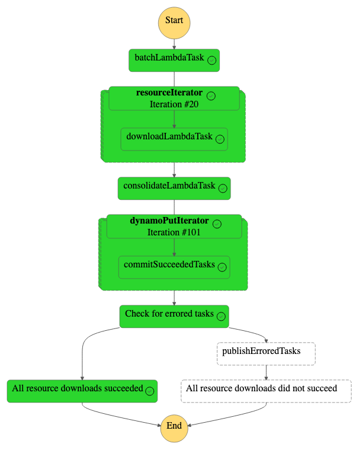
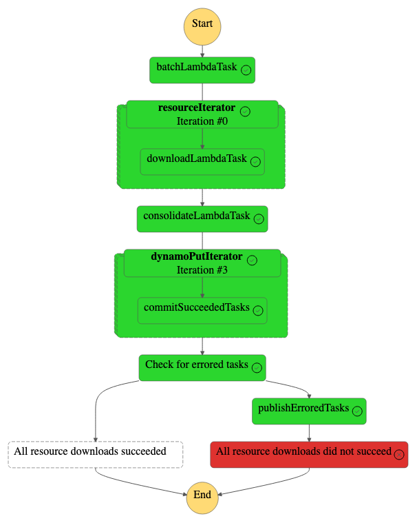

# Concurrently Image Downloading with AWS Step Functions

AWS Step Functions allow you to create state machines that follow a fixed or dynamic sequence of
steps with great integration with other AWS products. To use AWS step functions
we can create a state machine to define the application workflow which dictates
which passes input and output between states and determine when/where states
are executed. This example explores how we can create a step function to
concurrently download hundreds on images while staying completely serverless!
The step function expect the following fields in the input json:

* baseUrl - This base url that the step function will use to download the images
* resourcePaths - From the base url, this is a list of paths to each of the images
* lambdaConcur - The is the maximum number of concurrent download requests each of our
    lambda can make. We want this value set to prevent making too many requests to
    the site hosting the images.

At a high level, the step function will perform the following tasks:

* Take the list of resources and turn them into smaller batches
* Download the images from multiple batches using concurrent
running lambdas and report the location in s3 they are stored as well as 
their download status
* Store the s3 download location to dynamnodb for each image if the image
download was successful
* Notify an SNS topic if any images did not complete successfully

Images that the step function downloads are stored to a "folder" in s3 where
a dynamodb table will keep track of the url of their images as well as their
object name in s3. Additionally, a SNS topic will notify us of any images that
failed to download.

I've broken up the architecture into three main components:

* Global resources
* Step function tasks and their associated resources
* The step function definition and API gateway integration

## Global Resources

To start, we can define an s3 bucket which will store the images downloaded by
our step function. I've set up the bucket to move object to Glacier Instant
Retrieval after one day.

```typescript
// An s3 bucket to place our images into
const imagesBucket = new s3.Bucket(this, "imagesBucket", {
    blockPublicAccess: s3.BlockPublicAccess.BLOCK_ALL,
    encryption: s3.BucketEncryption.S3_MANAGED,
    versioned: false,
    removalPolicy: cdk.RemovalPolicy.DESTROY,
    lifecycleRules: [
        {
            transitions: [
                {
                    storageClass: s3.StorageClass.GLACIER_INSTANT_RETRIEVAL,
                    transitionAfter: cdk.Duration.days(1),
                },
            ],
        },
    ],
});
```

We will also define a dynamodb table where each row will consist of the url of
a downloaded image as well as the object name within the above s3 bucket. We
will use the url as the key value.

```typescript
// Url to s3 name dynamo table
const urlToNameTable = new dynamodb.Table(this, "urlToName", {
    partitionKey: { name: "url", type: dynamodb.AttributeType.STRING },
    billingMode: dynamodb.BillingMode.PAY_PER_REQUEST,
    removalPolicy: cdk.RemovalPolicy.DESTROY,
});
```

## Step Function Tasks and Resources

I'll only go through explaining a single task since they all more or less the
same way:

1. Set up resources for the task
2. Pass the resources created above to a new step function task
3. Specify inputs paths hand down from previous tasks for the new task
4. Specify outputs paths to be passed onto subsequent tasks in the new task

Let's look at how the map download works since it's perhaps one of the more complicated
tasks. Following the above guide, we will first need the lambda that wil be used to download the images.

```typescript
// Create a lambda to download images using the base url and resource
// paths
const downloadLambda = new lambda.Function(this, "downloadLambda", {
    runtime: lambda.Runtime.PYTHON_3_11,
    code: lambda.Code.fromAsset(
    join(__dirname, "..", "lambdas", "download-lambda"),
    {
        bundling: {
            image: lambda.Runtime.PYTHON_3_11.bundlingImage,
            command: [
                "bash",
                "-c",
                "set -euxo pipefail; pip install -r requirements.in -t /asset-output && cp -au . /asset-output",
            ],
        },
    }
    ),
    handler: "download_lambda.handler",
    environment: {
    IMAGES_BUCKET_NAME: imagesBucket.bucketName,
    },
});
```

The usage of the `command` argument in above is used to install python libraries
required for our lambda to run. Since our download lambda will be saving the downloaded images to s3, we will need
to provide write permissions to `downloadLambda`.

```typescript
// Allows us to save downloaded images to s3
imagesBucket.grantWrite(downloadLambda);
```

Create the new task and specifying the inputs and outputs will be a bit tricker
since map tasks expect an array of items where each item is passed to another task,
called the iterator task, that is use to process a single item. We can start by 
creating the iterator task. The iterator task will run our `downloadLambda` from
above using the entire input from the batching stage. Since data passed between
tasks is all JSON, we can use
[JSONPath Syntax](https://support.smartbear.com/alertsite/docs/monitors/api/endpoint/jsonpath.html)
to select specific parts of JSON we would like from our inputs/to send to our
task output. We can tell the iterator task to use the entire input by
specifying `'$'` as our input path. The `'$'` represents the entire JSON object.
Will we also want to keep the entire output from each of the iterator task. We
setup the image download lambda using the `LambdaInvoke` construct.

```typescript
// Create a stepfunction task for the download lambda
const downloadLambdaTask = new tasks.LambdaInvoke(
    this,
    "downloadLambdaTask",
    {
        lambdaFunction: downloadLambda,
        // Use the entire input
        inputPath: "$",
        // Replace the entire task output with the result
        resultPath: "$",
        // Ignore any lambda invocation metadata
        payloadResponseOnly: true,
        taskTimeout: sfn.Timeout.duration(cdk.Duration.seconds(120)),
    }
);
```

To determine the input and output paths for our map task, the `batchLambda`
produces a output similar to the following.

```json
"tasks": [
  {
    "resourcePaths": [
      "ad/ad.gif",
      "ae/ae.gif",
      "af/af.gif",
      "ag/ag.gif",
      "al/al.gif"
    ],
    "batchInput": {
      "baseUrl": "https://www.fluentpython.com/data/flags",
      "lambdaConcur": 5
    }
  },
  {
    "resourcePaths": [
      "am/am.gif",
      "ao/ao.gif",
      "ar/ar.gif",
      "at/at.gif",
      "au/au.gif"
    ],
    "batchInput": {
      "baseUrl": "https://www.fluentpython.com/data/flags",
      "lambdaConcur": 5
    }
  },
  // ...
]
```

Thus, the list of items for our iteration lambda to process is located under the
`'$.tasks'` path. Since the map task passess a single item to each iterator task
the input for each iterator task will look similar to the following

```json
{
    "resourcePaths": [
      "am/am.gif",
      "ao/ao.gif",
      "ar/ar.gif",
      "at/at.gif",
      "au/au.gif"
    ],
    "batchInput": {
      "baseUrl": "https://www.fluentpython.com/data/flags",
      "lambdaConcur": 5
    }
  }
```

The output of each iterator lambda will be a list of objects
with the following structure

```json
{
  "url": "https://www.fluentpython.com/data/flags/ag/ag.gif",
  "statusCode": 200,
  "filename": "www.fluentpython.com/ag.gif"
}
```

The map task will collate the outputs of each processed item into its own list.
To flatten these outputs into a single list we can use the following JSONPath
syntax `'$[*][*]'` meaning that the output sent to the sent task will look similar
to the following.

```json
[
  {
    "url": "https://www.fluentpython.com/data/flags/ag/ag.gif",
    "statusCode": 200,
    "filename": "www.fluentpython.com/ag.gif"
  },
  {
    "url": "https://www.fluentpython.com/data/flags/ae/ae.gif",
    "statusCode": 200,
    "filename": "www.fluentpython.com/ae.gif"
  },
  {
    "url": "https://www.fluentpython.com/data/flags/ad/ad.gif",
    "statusCode": 200,
    "filename": "www.fluentpython.com/ad.gif"
  },
  {
    "url": "https://www.fluentpython.com/data/flags/al/al.gif",
    "statusCode": 200,
    "filename": "www.fluentpython.com/al.gif"
  },
  {
    "url": "https://www.fluentpython.com/data/flags/af/af.gif",
    "statusCode": 200,
    "filename": "www.fluentpython.com/af.gif"
  }
]
```

With this, we have everything we need to build our map task

```typescript
// This map iterator will start a pool of lambda tasks each with a
// single item from resultSelector
const itemIterator = new sfn.Map(this, "resourceIterator", {
  maxConcurrency: maxLambdaConcurrency,
  itemsPath: "$.tasks",
  // Flatten the results from above into a single list
  resultSelector: {
    "results.$": "$[*][*]",
  },
});
```

## The Step Function Definition and API Gateway Integration

The state machine itself is created by chaining tasks together using the 
`sfn.Chain` construct. The information passed to and from states is determined
by the `inputPath`, `outputPath` and `resultPath` defined at the task 
definition level.

```typescript
// After publishing errored task, fail the stepfunction invocation.
const publishErroredTasksAndFail = sfn.Chain.start(
  publishErroredTasks
).next(
  new sfn.Fail(this, "All resource downloads did not succeed", {
    cause: "One or more resources failed to download",
  })
);

// Define the statemachine
const stateMachineDefinition = sfn.Chain.start(batchLambdaTask)
.next(itemIterator.iterator(downloadLambdaTask))
.next(consolidateLambdaTask)
.next(dynamoPutIterator.iterator(commitSucceededToDynamoTask))
.next(
new sfn.Choice(this, "Check for errored tasks")
  .when(
    sfn.Condition.booleanEquals("$.allSucceeded", false),
    publishErroredTasksAndFail
  )
  .otherwise(new sfn.Pass(this, "All resource downloads succeeded"))
);

const mapStateMachineDefinition = new sfn.StateMachine(
  this,
  "DownloadImagesConcurrently",
  {
    definitionBody: sfn.DefinitionBody.fromChainable(
      stateMachineDefinition
    ),
    removalPolicy: cdk.RemovalPolicy.DESTROY,
  }
);
```

Creating the step function accomplished using a builder pattern. Tasks that
that perform conditioning can recursively take other tasks as input to run
a single path of execution. An api gateway has also been setup for us to hit the
step function over a network, the following cdk code creates the resources
required to do this.

```typescript
// Create a HTTP API endpoint to invoke our step function
// To start we will need to give the endpoint permission to
// invoke our function
const httpApiRole = new iam.Role(this, "HttpApiRole", {
  assumedBy: new iam.ServicePrincipal("apigateway.amazonaws.com"),
  inlinePolicies: {
    AllowSFNExec: new iam.PolicyDocument({
      statements: [
        new iam.PolicyStatement({
          actions: ["states:StartExecution"],
          effect: iam.Effect.ALLOW,
          resources: [mapStateMachineDefinition.stateMachineArn],
        }),
      ],
    }),
  },
});

const api = new apigwv2alpha.HttpApi(this, "StateMachineApi", {
  createDefaultStage: true,
});

// Create an AWS_PROXY integration between the HTTP API and our Step Function
const stepFunctionIntegration = new apigwv2.CfnIntegration(
  this,
  "stepFunctionIntegration",
  {
    apiId: api.httpApiId,
    integrationType: "AWS_PROXY",
    connectionType: "INTERNET",
    integrationSubtype: "StepFunctions-StartExecution",
    credentialsArn: httpApiRole.roleArn,
    requestParameters: {
      Input: "$request.body",
      StateMachineArn: mapStateMachineDefinition.stateMachineArn,
    },
    payloadFormatVersion: "1.0",
    timeoutInMillis: cdk.Duration.seconds(10).toMilliseconds(),
  }
);
```

The `api` provides a network endpoint for us to send requests and to quick off
a step function execution. The `stepFunctionIntegration` resource acts a 
mediator between AWS Step Functions and AWS Api Gateway. From a incoming request
from our pai gateway, the `stepFunctionIntegration` dictates what API call
should be made of which step function, and feeds the body of the request in the
start of the step function. The `httpApiRole` determines what permission the
`stepFunctionIntegration` should have.

## How To Test

First clone the repository

```bash
git clone https://github.com/Michae1CC/aws-cdk-examples
```

and change directory into the `step-function-map-io` folder.

```bash
cd step-function-map-io

Run

```bash
npm install
```

to install the required packages to create our Cloudformation template and then

```bash
cdk bootstrap && cdk deploy
```

Make sure you have docker running during this step.
You should see an output displaying the api gateway url

```text
Outputs:
StepFunctionMapIoStack.HttpApiUrl = https://...
Stack ARN:
arn:aws:cloudformation:...
```

There are two bash scripts within the script folder, each script will make a
request to our api gateway endpoint. The `fail.sh` script contains a resource
path that doesn't exist which will cause the step function invocation to fail.

### Testing the success case

To test the success case, run the `./script/success.sh` bash script and provide
the api gateway url as the first argument.

```bash
bash ./scripts/success.sh https://...
```

You should see output similar to the following confirming that a new executing
has started!

```text
HTTP/2 200 
date: Thu, 12 Oct 2023 11:58:09 GMT
content-type: application/x-amz-json-1.0
content-length: 180
x-amzn-requestid: 8f4ae49f-b8ee-4a17-88fe-66
apigw-requestid: Mr_UsgyzIAMEMKg=

{"executionArn":"arn:aws:states:us-east-1:...}
```

You navigate to the step function console to view the state graph of the
execution as well as the execution logs. This is what the execution graph
for this step function invocation looked like for my run.



Since all the resource paths exist in this invocation, all the downloads
should have succeeded.

### Testing the fail case

To test the success case, run the `./script/fail.sh` bash script and again
provide the api gateway url as the first argument. If you would like to 
receive a notification from SNS about failed tasks remember to add a 
subscription to the topic created by this deployment. For this example, I've
just subscribed my personal gmail using the AWS console.

```bash
bash ./scripts/fail.sh https://...
```

Similar to the success case, there should be output confirming a new step
function invocation has started.

```text
HTTP/2 200 
date: Thu, 12 Oct 2023 12:20:14 GMT
content-type: application/x-amz-json-1.0
content-length: 179
x-amzn-requestid: ...
apigw-requestid: MsCj1h-ioAMESiw=

{"executionArn":"arn:aws:states:us-east-1:...}
```

Navigating the step function console, the state function should look similar
to the following.



This time, the `"zz/zz.gif"` doesn't exist as a resource causing the step function
to execute the 'failure' branch. I've also received an email from my personal
gmail account indicating which resource failed to download.

```text
["Could not find: https://www.fluentpython.com/data/flags/zz/zz.gif"]
```

## References

* <https://docs.aws.amazon.com/step-functions/latest/dg/amazon-states-language-map-state.html>
* <https://www.datadoghq.com/knowledge-center/aws-step-functions/>
* <https://docs.aws.amazon.com/step-functions/latest/dg/tutorial-itembatcher-param-task.html>
* <https://github.com/cdk-patterns/serverless/tree/main/the-state-machine>
* <https://github.com/aws-samples/serverless-patterns/tree/main/stepfunction-polly-s3-cdk>
* <https://github.com/aws-samples/serverless-patterns/blob/main/stepfunction-ses-cdk/lib/stepfunction-ses-cdk-stack.ts>
* <https://github.com/fluentpython/example-code-2e>
* <https://docs.aws.amazon.com/lambda/latest/dg/API_Operations.html>
* <https://docs.aws.amazon.com/step-functions/latest/dg/concepts-input-output-filtering.html>
