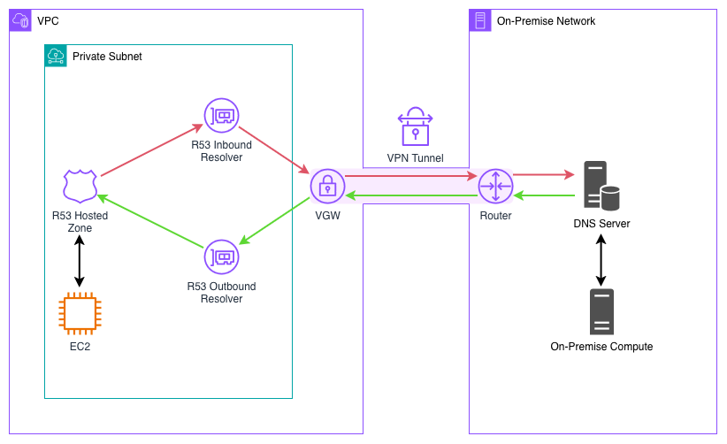
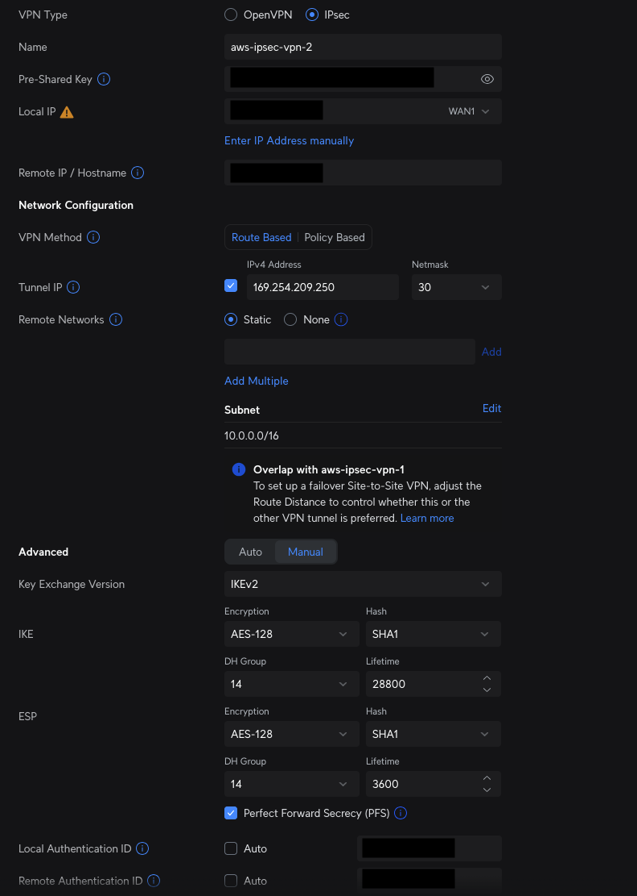
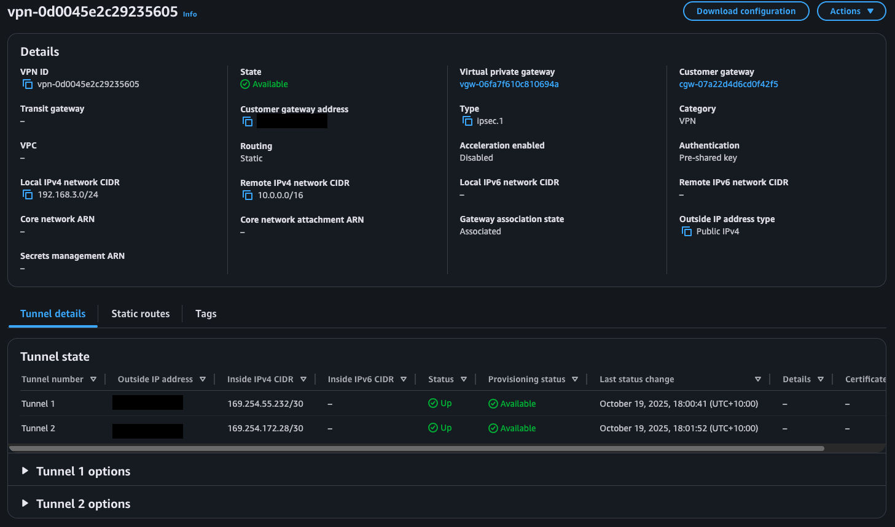

# Site-to-Site VPN via VGW

This example demonstrates how AWS Virtual Private Gateways can be used to
establish site-to-site VPN connections between AWS and an external network.

<picture align="center">
  <source
    srcset="./img/vgw-site2site-vpn-architecture.png"
    media="(orientation: portrait)" />
  
</picture>

The Customer Gateway is used to provide AWS with configuration details about the
local network device.

```typescript
const customerGateway = new ec2.CfnCustomerGateway(
    this,
    "customer-gateway",
    {
        type: "ipsec.1",
        // The customer outside public IP address
        ipAddress: ON_PREM_PUBLIC_IP,
        // A BGP ASN must be set even though we are not using BGP here
        bgpAsn: 65123,
    }
);
```

The `CfnVPNConnection` provides the configuration and parameters for the IPSec
VPN tunnel. The `localIpv4NetworkCidr` and `remoteIpv4NetworkCidr` refer to the
private subnet CIDRs used by the local and remote networks, respectively.
Note that the IPSec phase1/2 encryption and integrity algorithms may be omitted
allowing the negotiating of any parameters from the local side so long as AWS
supports it.

```typescript
const tunnelSpecificationShared: ec2.CfnVPNConnection.VpnTunnelOptionsSpecificationProperty =
    {
        ikeVersions: [
            {
            // Establish phase 1 the IPsec tunnel using the more secure IKEv2 protocol
            value: "ikev2",
            },
        ],
        logOptions: {
            cloudwatchLogOptions: {
            logEnabled: true,
            logGroupArn: vpnConnectionLogGroup.logGroupArn,
            logOutputFormat: "json",
            },
        },
        phase1LifetimeSeconds: 28_800,
        // IPsec phase 2 configurations
        phase2LifetimeSeconds: 3_600,
        // Let AWS choose the inside tunnel CIDR and pre-shared key
        tunnelInsideCidr: undefined,
        preSharedKey: undefined,
    };

const vpnConnection = new ec2.CfnVPNConnection(
    this,
    "vpn-connection-on-prem",
    {
        // NOTE: Outside IPs are public IPs used for tunnel setup while inside
        // IPs are used for routing raw data and BGP (not used here)
        type: "ipsec.1",
        // NOTE: Each customer gateway is connected to two different AWS endpoints
        // using a single VPN connection.
        customerGatewayId: customerGateway.attrCustomerGatewayId,
        localIpv4NetworkCidr: ON_PREM_IPV4_SUBNET,
        outsideIpAddressType: "PublicIpv4",
        remoteIpv4NetworkCidr: AWS_VPC_IPV4_SUBNET,
        staticRoutesOnly: true,
        vpnGatewayId: vpnGateway.attrVpnGatewayId,
        // To configure, see: https://docs.aws.amazon.com/cdk/api/v2/docs/aws-cdk-lib.aws_ec2.CfnVPNConnection.VpnTunnelOptionsSpecificationProperty.html
        vpnTunnelOptionsSpecifications: [
            tunnelSpecificationShared,
            tunnelSpecificationShared,
        ],
    }
);
```

The infrastructure also create Route53 Inbound and Outbound endpoints to allow
DNS integration between the local and remote networks.

The R53 Inbound Endpoint acts as a endpoint for remote services to forward DNS
queries to be resolved by Route53 Private Hosted Zones associated with the
VPC they have been injected into. If subnets are provided for the `ipAddress`
parameter (as done here), then AWS automatically selects an IP address from
the subnets to use for the Inbound Endpoint. DNS servers in the local network
should be updated to forward DNS queries intended to be resolved by Private
Hosted Zones to the Inbound Endpoint IP addresses.

```typescript
const dnsResolverInboundEndpoint = new route53resolver.CfnResolverEndpoint(
    this,
    "dns-resolver-inbound-endpoint",
    {
        direction: "INBOUND",
        // Even though the minimum is 1, Route 53 requires that you create at least two,
        // see: https://docs.aws.amazon.com/cdk/api/v2/docs/aws-cdk-lib.aws_route53resolver.CfnResolverEndpoint.html#ipaddresses
        ipAddresses: props.vpc.selectSubnets().subnetIds.map((subnetId) => ({
            subnetId: subnetId,
        })),
        securityGroupIds: [resolverEndpointSg.securityGroupId],
        resolverEndpointType: "IPV4",
    }
);
```

R53 Outbound Endpoint complements the Inbound Endpoint by forwarding DNS
requests from remote network devices to local network DNS servers. DNS rules
for the Outbound Endpoints must be establish to understand which domains the
Outbound Endpoints should forward queries for.

```typescript
const dnsResolverOutboundEndpoint = new route53resolver.CfnResolverEndpoint(
    this,
    "dns-resolver-outbound-endpoint",
    {
        direction: "OUTBOUND",
        // Even though the minimum is 1, Route 53 requires that you create at least two,
        // see: https://docs.aws.amazon.com/cdk/api/v2/docs/aws-cdk-lib.aws_route53resolver.CfnResolverEndpoint.html#ipaddresses
        ipAddresses: props.vpc.selectSubnets().subnetIds.map((subnetId) => ({
            subnetId: subnetId,
        })),
        securityGroupIds: [resolverEndpointSg.securityGroupId],
        resolverEndpointType: "IPV4",
    }
);

const onpremEndpointRule = new route53resolver.CfnResolverRule(
    this,
    "onprem-resolver-rule",
    {
        ruleType: "FORWARD",
        domainName: "internal.onprem",
        resolverEndpointId: dnsResolverOutboundEndpoint.attrResolverEndpointId,
        // Requires two IP address, just use the same two
        targetIps: [
            {
            ip: ON_PREM_PRIVATE_DNS_SERVER_IP,
            port: "53",
            },
            {
            ip: ON_PREM_PRIVATE_DNS_SERVER_IP,
            port: "53",
            },
        ],
    }
);

new route53resolver.CfnResolverRuleAssociation(
    this,
    "onprem-resolver-rule-association",
    {
        resolverRuleId: onpremEndpointRule.attrResolverRuleId,
        vpcId: props.vpc.vpcId,
    }
);
```

## How to Test

First clone the repository

```bash
git clone https://github.com/Michae1CC/aws-cdk-examples
```

and change directory into the `vgw-site2site-vpn` folder.

```bash
cd vgw-site2site-vpn
```

Run

```bash
npm install
```

to install the required packages and then deploy the `vpc-stack` and `vpn-stack`

```bash
cdk deploy vpc-stack vpn-stack
```

Once the `vpn-stack` has deployed, you will have to configure the on-premise
router with the deployed Virtual Gateway resource - you can download a
configurations file for the VPN from the Site-to-Site VPN connections page
within the AWS console. I'm using a Ubiquity Gateway 7 which allows users to 
establish IPSec VPN tunnels within the web configuration
portal.



Once the VPN tunnels have been configured on the remote side, the tunnel status
within the Site-to-Site VPN connections AWS console should display as 'Up'.



Network connectivity between the two networks can be tested by SSHing onto a
server in the local networking and pinging an EC2 instance on the remote network.

```text
$ ping 10.0.51.217
PING 10.0.51.217 (10.0.51.217) 56(84) bytes of data.
64 bytes from 10.0.51.217: icmp_seq=1 ttl=126 time=14.7 ms
64 bytes from 10.0.51.217: icmp_seq=2 ttl=126 time=14.7 ms
64 bytes from 10.0.51.217: icmp_seq=3 ttl=126 time=14.3 ms
```

Next we can deploy the `route53-stack`.

```bash
cdk deploy route53-stack
```

You will need to configure the local DNS server to forward queries to the
Route53 Inbound Endpoints. You should now be able to resolve DNS queries for
the Private Hosted zone from local servers.

```text
$ dig internal.awsvpc @10.0.60.146

; <<>> DiG 9.18.33-1~deb12u2-Debian <<>> internal.awsvpc @10.0.60.146
;; global options: +cmd
;; Got answer:
;; ->>HEADER<<- opcode: QUERY, status: NOERROR, id: 3046
;; flags: qr rd ra; QUERY: 1, ANSWER: 1, AUTHORITY: 0, ADDITIONAL: 1

;; OPT PSEUDOSECTION:
; EDNS: version: 0, flags:; udp: 1232
;; QUESTION SECTION:
;internal.awsvpc.		IN	A

;; ANSWER SECTION:
internal.awsvpc.	1800	IN	A	10.0.51.217

;; Query time: 16 msec
;; SERVER: 10.0.60.146#53(10.0.60.146) (UDP)
;; WHEN: Sun Oct 19 21:47:48 AEST 2025
;; MSG SIZE  rcvd: 60
```

Route53 should also now be able to resolve DNS queries for domains configured
by local DNS servers.

```text
ec2-user@ip-10-0-51-217 ~]$ ping node2.internal.onprem
PING node2.internal.onprem (192.168.3.145) 56(84) bytes of data.
64 bytes from ip-192-168-3-145.ap-southeast-2.compute.internal (192.168.3.145): icmp_seq=1 ttl=63 time=14.7 ms
64 bytes from ip-192-168-3-145.ap-southeast-2.compute.internal (192.168.3.145): icmp_seq=2 ttl=63 time=14.3 ms
64 bytes from ip-192-168-3-145.ap-southeast-2.compute.internal (192.168.3.145): icmp_seq=3 ttl=63 time=14.4 ms
64 bytes from ip-192-168-3-145.ap-southeast-2.compute.internal (192.168.3.145): icmp_seq=4 ttl=63 time=14.1 ms
^C
--- node2.internal.onprem ping statistics ---
4 packets transmitted, 4 received, 0% packet loss, time 3004ms
rtt min/avg/max/mdev = 14.110/14.377/14.665/0.202 ms
```

## References

* <https://docs.aws.amazon.com/vpn/latest/s2svpn/your-cgw.html>
* <https://aws.amazon.com/blogs/containers/building-an-amazon-ecs-anywhere-home-lab-with-amazon-vpc-network-connectivity/>
* <https://docs.aws.amazon.com/vpn/latest/s2svpn/VPC_VPN.html>
* <https://www.youtube.com/watch?v=y0rjxXnf1Tk>
* <https://www.youtube.com/watch?v=ymzqUTczkzM>
* <https://www.youtube.com/watch?v=Z81Z9HPoVUQ>
* <https://networklessons.com/security/ipsec-internet-protocol-security>
* <https://docs.aws.amazon.com/directconnect/latest/UserGuide/create-virtual-private-gateway.html>
* <https://docs.aws.amazon.com/cdk/api/v2/docs/aws-cdk-lib.aws_ec2.CfnVPNGateway.html>
* <https://docs.aws.amazon.com/cdk/api/v2/docs/aws-cdk-lib.aws_ec2.CfnVPNConnection.html>
