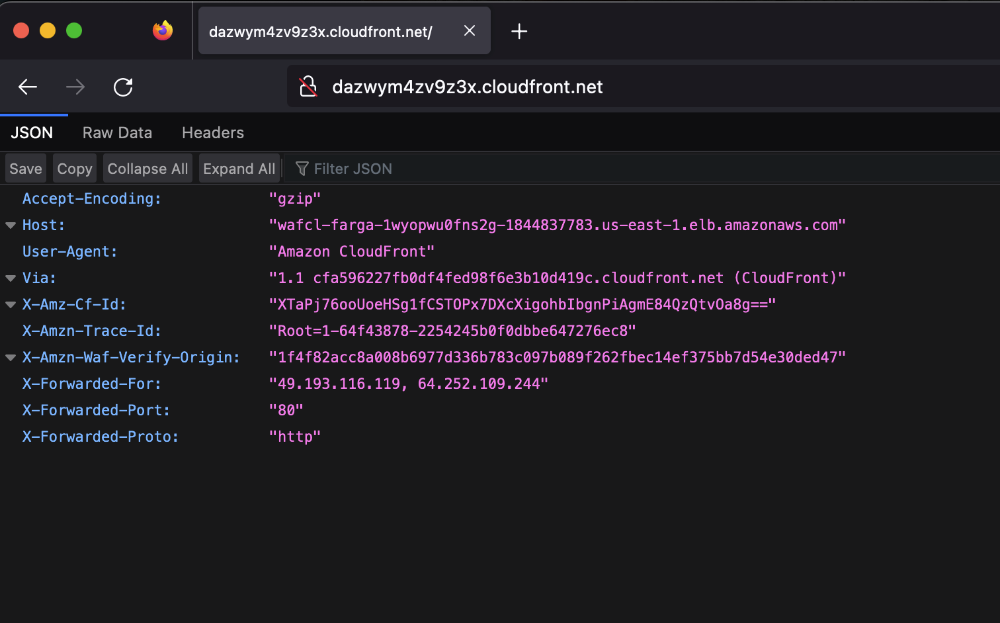
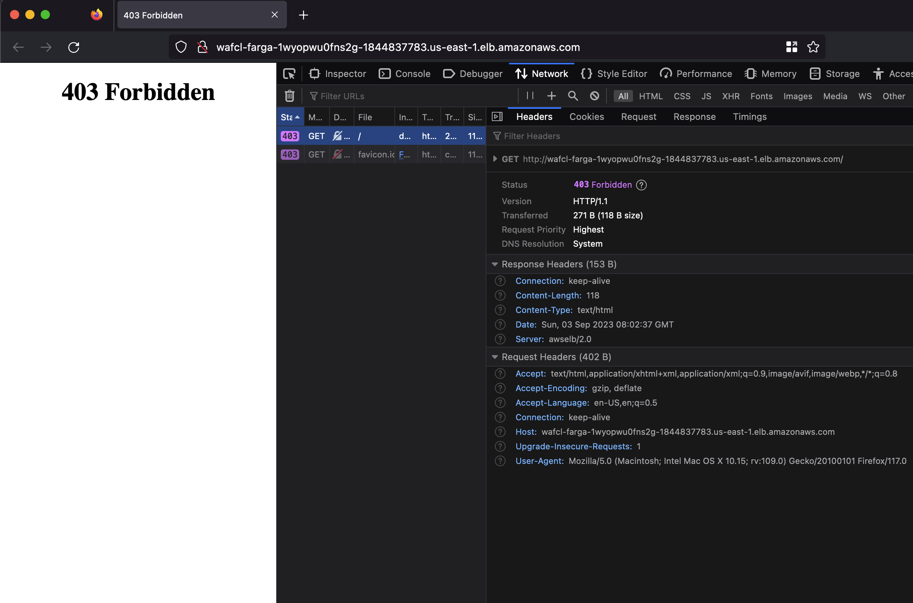

# Enhanced Cloudfront Security with AWS WAF

This example is based off an AWS security blog authored by Cameron Worrell (see references). In this blog, Cameron demonstrates how content served through Cloudfront can be made more secure by attaching a custom HTTP header to traffic coming through Cloudfront using AWS WAF. We attempt to recreate the setup from the blog here with a few minor alterations.

## Secure Token Generation

We can create a secure token for our custom HTTP header using an AWS Custom resource. An AWS Custom resource allows us to define constructs whose life cycle is tied to the stack it was created in. These custom resource allows us to execute lambdas during the resource creation and to then use the results of the lambda within our stack. Here's the custom I wrote that will generate our secure token (see [token-generator.ts](./lib/token-generator.ts)).

```typescript
/**
 * Creates a random string using a hexadecimal character set.
 * The string generated is cryptographically strong and is suitable
 * for managing data such as passwords, account authentication, security
 * tokens, and related secrets.
 */
export class TokenGenerator extends Construct {
  /**
   * The CloudFormation resource type.
   */
  public static readonly RESOURCE_TYPE = "Custom::AWSCDK-TokenGenerator";

  /**
   * The default string length.
   */
  public static readonly DEFAULT_STRING_LENGTH = 64;

  private _resource: cdk.CustomResource;

  constructor(scope: Construct, id: string, props: TokenGeneratorProps) {
    super(scope, id);

    // Lambda payload has a limit of 6MB. Only allow up to 5MB for the
    // string
    const maxLength = 5 * 1000 * 1000;
    if (props.length && (props.length <= 0 || props.length > maxLength)) {
      throw new Error(
        "The random string length must be within range 0 <= length < 5,000,000."
      );
    }

    const provider = this.createProvider();

    this._resource = new cdk.CustomResource(
      this,
      "GenerateTokenGeneratorResource",
      {
        resourceType: TokenGenerator.RESOURCE_TYPE,
        serviceToken: provider.serviceToken,
        properties: {
          StringLength: props.length ?? TokenGenerator.DEFAULT_STRING_LENGTH,
        },
      }
    );
  }

  private createProvider(): cdk.custom_resources.Provider {
    const handler = new Function(this, "TokenGeneratorGenerator", {
      runtime: Runtime.PYTHON_3_11,
      handler: "index.handler",
      memorySize: 256,
      timeout: cdk.Duration.minutes(5),
      description: "Generates a secure random string",
      code: Code.fromAsset(path.join(__dirname, "token-generator-lambda")),
    });

    const provider = new cdk.custom_resources.Provider(
      this,
      "GenerateStringProvider",
      {
        onEventHandler: handler,
      }
    );

    return provider;
  }

  public get value(): string {
    return cdk.Token.asString(this._resource.getAtt("Value"));
  }
}
```

This custom resource executes the `TokenGeneratorLambda` (see [./token-generator-lambda/index.py](./lib/token-generator-lambda/index.py)), that securely generates a random string. This string is returned by the lambda and may be accessed within the custom resource from the resource's attributes.

## Fargate and WAF

Let's looks at creating a fargate service that only accepts http traffic from sources that have our custom http header with the secret token as the value. We need to do this before setting up cloudfront since to set up cloudfront we need a reference to the fargate ALB. The WAF used to control traffic to our fargate ALB is shown below.

```typescript
// Create our alb ACL
const albACL = new wafv2.CfnWebACL(this, "AlbACL", {
    scope: "REGIONAL",
    description: "Verify Origin Check WAF",
    defaultAction: {
    block: {},
    },
    visibilityConfig: {
    metricName: "demo-APIWebACL",
    cloudWatchMetricsEnabled: false,
    sampledRequestsEnabled: false,
    },
    // Create a single rule to match our token in our custom header
    rules: [
    {
        action: { allow: {} },
        name: "AllowVerifyString",
        priority: 0,
        statement: {
        byteMatchStatement: {
            fieldToMatch: {
            headers: {
                matchPattern: {
                includedHeaders: ["X-Amzn-Waf-Verify-Origin"],
                },
                matchScope: "ALL",
                oversizeHandling: "NO_MATCH",
            },
            },
            positionalConstraint: "EXACTLY",
            searchString: tokenParameterStore.stringValue,
            textTransformations: [
            {
                priority: 0,
                type: "NONE",
            },
            ],
        },
        },
        visibilityConfig: {
        cloudWatchMetricsEnabled: false,
        metricName: "AlbACLMeterics",
        sampledRequestsEnabled: false,
        },
    },
    ],
});
```

This WAF checks that incoming http/s traffic contains a header with the name `X-Amzn-Waf-Verify-Origin` and checks that the value of this header matches the value of our secure token *exactly*. The resources to create our fargate service are listed next.

```typescript
// EC2
const vpc = new ec2.Vpc(this, "Vpc", {
    natGateways: 0,
    maxAzs: 2,
    subnetConfiguration: [
    {
        name: "public-subnet",
        subnetType: ec2.SubnetType.PUBLIC,
        cidrMask: 24,
    },
    ],
});

const cluster = new ecs.Cluster(this, "MyCluster", {
    vpc: vpc,
});

const fargate = new ApplicationLoadBalancedFargateService(
    this,
    "FargateService",
    {
    assignPublicIp: true,
    cluster: cluster,
    cpu: 512,
    desiredCount: 1,
    memoryLimitMiB: 1024,
    taskImageOptions: {
        image: ecs.ContainerImage.fromAsset(join(__dirname, "./server")),
        environment: {
        name: "Fargate Service",
        },
    },
    }
);
```

This defines a new vpc for our service to sit in as well as instance profile and desired ec2 instance count within the cluster. The above WAF can be attached to the ALB produced by the fargate cluster using the `CfnWebACLAssociation` Cfn resource. I've intentionally left this fargate service public to demonstrate later what happens when we attempt to access our web application directly through the ALB.

```typescript
// Attach our Alb ACL to the loadbalancer created by fargate
new wafv2.CfnWebACLAssociation(this, "FargateWebACLAss", {
    webAclArn: albACL.attrArn,
    resourceArn: fargate.loadBalancer.loadBalancerArn,
});
```

The ec2 instances themselves are simply serving a very minimal webpage that returns original request as raw json (see [index.py](./lib/server/index.py)).

```python
from flask import Flask, request

app = Flask(__name__)


@app.route("/", defaults={"path": ""})
@app.route("/<path:path>")
def index(path):
    request_as_json = dict(request.headers)
    return request_as_json


if __name__ == "__main__":
    app.run(debug=True, host="0.0.0.0", port=80)
```

## Cloudfront and WAF

Cloudfront will act as the primary source of content distribution for our web application. The WAF used to attach our custom secure token header is listed below.

```typescript
// Create the ACL for cloudfront
const cloudfrontACL = new wafv2.CfnWebACL(this, "CloudfrontACL", {
    // Since we're using a cloudfront scope, resources must be created in
    // the us-east-1 region
    scope: "CLOUDFRONT",
    description:
    "Attaches custom headers to requests to Cloudfront.",
    defaultAction: {
    allow: {
        customRequestHandling: {
        insertHeaders: [
            {
            // Note that AWS WAF will append "X-Amzn-Waf-"
            // to the provided name, meaning that full name used
            // will be "X-Amzn-Waf-Verify-Origin"
            name: "Verify-Origin",
            value: tokenParameterStore.stringValue,
            },
        ],
        },
    },
    },
    visibilityConfig: {
    metricName: "verify-origin",
    cloudWatchMetricsEnabled: false,
    sampledRequestsEnabled: false,
    },
    // Leave this empty.
    // We are only using this ACL as a cost effective way of attaching
    // custom headers to requests
    rules: [],
});
```

It's unsure why Cameron decided to use a WAF just to attach the the custom header since Cloudfront has the ability to do this as well (see [Adding custom headers to origin requests](https://docs.aws.amazon.com/AmazonCloudFront/latest/DeveloperGuide/add-origin-custom-headers.html)). Perhaps other rules are usually attached to WAFs standing in front of Cloudfront to catch nefarious traffic before it reaches Cloudfront. In any case, cdk code to create our Cloudfront distribution with the attached WAF is provided below.

```typescript
const myDistribution = new cloudfront.Distribution(this, "MyDistribution", {
    defaultBehavior: {
    origin: new LoadBalancerV2Origin(fargate.loadBalancer, {
        protocolPolicy: cloudfront.OriginProtocolPolicy.HTTP_ONLY,
    }),
    allowedMethods: cloudfront.AllowedMethods.ALLOW_ALL,
    },
    webAclId: cloudfrontACL.attrArn,
});
```

## How to Test

First clone the repository

```bash
git clone https://github.com/Michae1CC/aws-cdk-examples
```

and change directory into the `waf-cloudfront-ssm` folder.

```bash
cd waf-cloudfront-ssm
```

Run

```bash
npm install
```

to install the required packages to create our Cloudformation template and them

```bash
cdk bootstrap && cdk deploy
```

You should see an output similar to the following

```bash
WafCloudfrontSsmStack.FargateServiceLoadBalancerDNS<random-text> = ...

WafCloudfrontSsmStack.FargateServiceServiceURL<random-text> = ...

WafCloudfrontSsmStack.cloudfrontDistributionName = ...

WafCloudfrontSsmStack.verifyOriginToken = ...
```

The `WafCloudfrontSsmStack.cloudfrontDistributionName` gives the domain name of the cloudfront distribution. Entering the domain name into our web-browser should display our original request (with a few other header added by AWS) as raw json.



However attempting to access our service through the ALB using the output value of `WafCloudfrontSsmStack.FargateServiceServiceURL` should give the following 403 error.



This is our WAF at work, blocking requests originating outside Cloudfront which lack our custom header.

Finally we can clean up all the resources created by this tutorial by running

```bash
cdk destroy
```

## Resources

* <https://aws.amazon.com/blogs/security/how-to-enhance-amazon-cloudfront-origin-security-with-aws-waf-and-aws-secrets-manager/>
* <https://stackoverflow.com/questions/71982850/aws-cdk-cant-access-alb-through-cloudfront-domain>
* <https://repost.aws/questions/QUi6e8FXZkQyCHd3g_on5CRQ/cdk-cloudfront-distribution-pointing-to-a-private-loadbalancer-on-a-vpc>
* <https://github.com/aws-samples/serverless-patterns/blob/main/cloudfront-waf-s3-cdk/src/CdkStack.cs>
* <https://github.com/aws-samples/serverless-patterns/tree/main/cloudfront-lambda-edge-cdk-python>
* <https://github.com/aws-samples/serverless-patterns/tree/main/apig-waf/src>
* <https://docs.aws.amazon.com/AmazonCloudFront/latest/DeveloperGuide/restrict-access-to-load-balancer.html>
* <https://awstut.com/en/2023/04/29/aws-waf-string-inspection-headers-querystring-body-cookies-en/>
